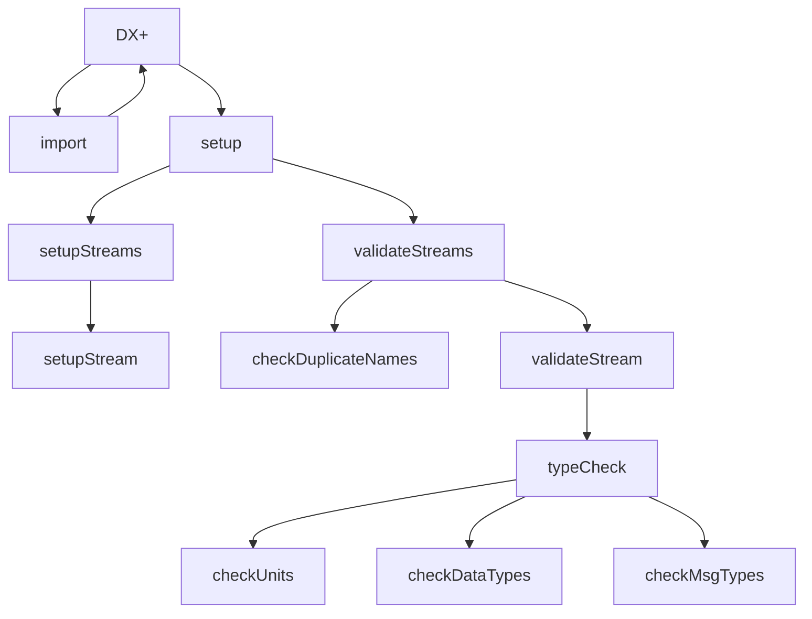

# Overview
The Component folder provides the base classes required to create and use components. This consists of the following files and classes. Please see the class API documentations for further detail of individual functions.

## Component

This file contains the "Component" base class. This class is used to provide an interface for each component and must be inherited and implemented.

## ComponentCallback
This file contains the base class for implementing a callback object for the component. This provides the "ComponentCallbackItem" base class which provides virtual functions for sending messages, propogating commands or requests, and retrieving the available commands and requests. This file also provides the "ComponentFunctionalCallbackItem" convienance class that allows providing lambdas as the callback.

The callback item is used by the component to allow communication from the component to the object managing it.

## ComponentManager
This file provides the implementation of the "ComponentManager" class. This class is responsible for registering available components, creating component instances, connecting data between components, and parsing a JSON Graph object into a data pipeline with the components requested in the graph. 

The ComponentManager creates and manages a threadpool. This threadpool is used to perform component tasks and queue results for the next component task.

The ComponentManager class will use the ComponentLibraryManager to load available components and register them into its memory. Custom implementations can also create components and register them directly with the manager. Given a JSON, the manager will parse the JSON, find the requested components based on the type UUID and create their instances. Next, it will determine the data connections between the components and connect them using a ComponentCallbackItem and a ComponentSubscriptionHandler.

The ComponentManager will also allow the initialization of a ComponentRemoteManager. The ComponentRemoteManager allows a networked device to control and activate the functions of the ComponentManager.

## ComponentRemoteManager

This file provides the ComponentRemoteManager class. The remote manager allows remote control of the ComponentManager. This is performed using a ZMQ request/reply socket pattern. The class requires an instance of a ComponentManager.

## ComponentSubscriptionHandler
This file contains the implementation for the ComponentSubscriptionHandler class. This class is used by the ComponentManager to connect data between components. This works by the class creating a data queue. When items on the data queu are pushed on, the class will queue the attached component to process the data as a task on the thread pool. This class restricts the work such that the current working task must complete and the data be popped off the queue before it enqueus another processing task for the next data item on the data queue. This class requires a Component and a threadpool object. Additionally, the subscription handler is designed to handle a single data stream. Therefore, it is not advisable to create a single subscription handler to process multiple data streams input from the sending component. This ensures data integrity in a multi-threaded environment.

## ComponentLibrary
This file contains the class definitions for ComponentLibrary, ComponentAdapter, and the ComponentLibraryManager.

### ComponentAdapter
The ComponentAdapter class contains the name of the component as a standard display name, the UUID for the component, a JSON object that describes the component, and a creation function to create an instance of the component. The adapter is used to register the component into the system and provide the means to create a component instance.

### ComponentLibrary
The ComponentLibrary class is a simple container class that contains a list of component adapters. A single DLL should contain a single ComponentLibrary Class This class simply contains the name to identify the library and a function to retrieve the available component adapters.

### ComponentLibraryManager
This class provides the means to load DLL's from provided paths and load the component library contained in each DLL. There is also a global function "getComponentLibraryManager" that creates a static instance of a ComponentLibraryManager for common use throughout the application.

### DLL Structure
A created DLL should export a single function "GetComponents" that returns a pointer to a ComponentLibrary object. The ComponentLibrary object is then used to load the ComponentAdapters within the library. The ComponentAdapters can then be used in the system to create and use components.

# Creating Components
Components can be created in C++ natively or in Python and C# using the SWIG wrapped API. To best explain the process of creating a component, we will walk through a simple example. This example will create a component as a processor that performs a simple scaling operation on the incoming data. While this is an example of a processor, it should be noted that there are 3 classes of components:

1. Source: This is defined as a root component that is a producer of data for the system
2. Processor: This component type receives data from other components, performs a task, and then sends new data to the next node in the data pipeline.
3. Ouput: This component type is defined as a receiver of data from other components and outputs the data external to the data pipeline. This can be a network streamer or file writer as examples. 

This walkthrough will detail these further as we go through and provide information for how they are defined.

## Defining the Class
In this example, we will create a comonent class: "CustomScalar". This class will inherit from the base Component class and implement required functions. We will provide a full example here, and will override all the available virtual functions to provide a full context for this example. This will not be needed fully in most cases.

```c++
#include <PhoenixCore/Component/Component.hpp>

class CustomScalar : public Component
{
public:
    struct customScalarStream_t : public stream_info_t{
        customScalarStream_t(GraphJson::StreamJson& strm, uint64_t index);
        ~customScalarStream(){}
        double scale = 1.0;
        double offset = 0.0;
    };
public:
    CustomScalar(const std::string& name);
    ~CustomScalar();
public:
    bool import(GraphJson::SourceJson& info, const std::vector<GraphJson::SourceJson>& parents) override;
    bool setup(std::shared_ptr<const GraphJson> graph, GraphJson::SourceJson& info) override;
    void start(const uint64_t& timestamp=0) override;
    void stop() override;
    void reset() override;
public:
    bool setupStreams(GraphJson::SourceJson& sj) override;
    bool setupStream(GraphJson::StreamJson& strm, uint64_t idx) override;
    bool validateStreams(const GraphJson::SourceJson& sj) override;
    bool validateStream(const GraphJson::StreamJson& sj) override;
    bool checkDuplicateNames(const std::vector<GraphJson::StreamJson>& streams) const override;
    bool checkUnits(const std::vector<Unit>& unitsInput, const JSON& unitsSupported) const override;
    bool checkDataTypes(const Message::data_types_t& dataTypesInput, const JSON& dataTypesSupported) const override;
    bool checkMsgTypes(const Message::msg_types_t& msgTypesInput, const JSON& msgTypesSupported) const override;
    bool mapStreams() override;
    bool typeCheck(const JSON& info, const GraphJson::StreamJson& strm) const override;

    std::string selfTest() override;
    void process(const Message &msg) override;
    const JSON info() override;

    std::vector<std::string> commands() const override;
    std::vector<std::string> requests() const override;
    JSON command(const JSON &) override;
    JSON request(const JSON&) override;

};

```

The above class definition provides all virtual overrides available for the component except for the Automations. The Automations will be described in another document. Next, we will go through the class implementation and describe what is being done.

## Defining the Component
The component is defined by a few informational objects. These define the component type ID, general information about the component, and available settings for the component.

### Component UUID
The component should contain a non-changing UUID as a string that represents the type. UUID's are used to avoid clashes with other defined components. While the API technically allows any string to represent the component type, a UUID is highly recommended. The best method is to use http://uuidgenerator.net to generate a UUID and copy it to your source implementation. This should be Version 4 and without braces as normal usage. In our example, we will define this in the class as a static const std::string variable in our implementation file.

```c++
static const std::string comp_uuid = "39d09444-da10-426c-a8d1-40e605008c15";
```

### Component Info
Next, we need to define the ComponentInfo. This is a JSON object and Phoenix uses nlohmann::json as the JSON parser/library. (https://json.nlohmann.me/). There are a few methods to define the JSON such as having it as a string in an included text file, but we will define it directly within the c++ using the syntax defined by nlohmann JSON.

Every item in the information object must be defined and is used in some way. Additionally, every component MUST support the following commands and requests:

1. Requests:
    1. status
1. Commands:
    1. start
    2. stop
    3. reset

These are normally handled in the base class by default. They are mentioned here due to potential overrides. The DX+ Platform requires these in order to provide informational displays to the user during operation. For file based inputs, an additional request of "progress" is needed as a percentage to provide progress feedback. This is not required, but is helpful in this case. 

An example JSON of the informational can be seen below. in C++ we will recreate this as a static const object in the implementation file.

```json
{
    "name": "Custom Scalar",
    "uuid": "39d09444-da10-426c-a8d1-40e605008c15",
    "vendor": "APEX",
    "description": "A custom scalar processor",
    "class": "processor",
    "class_type": "processor",
    "version": "2025.9.9",
    "feature": "custom-processor",
    "attrbutes": "CustomScalar_attrs.json",
    "helpfile": "CustomScalar.md",
    "requests": ["status"],
    "commands": ["start", "stop", "reset"],
    "supported_inputs": {
        "data_types": ["integer", "number"],
        "message_types": ["vector", "entry"],
        "units": [
            {"domain": "time", "name": null},
            {"domain": null, "name": null}
        ]
    }
}
```

Now, lets go through the information and cover its meanings. 

First, we have the Name. This is simply the display name for the component. Next, is the UUID which is the unique identifier for the component type in the system. The vendor and description fields provides the information for who created it and describes what it is/does. 

The class is either "source" meaning a producer of data as a means to bring external data into the data pipeline, "processor" meaning a processor of data, or "output" meaning a consumer of data as a means to export the data external to the data pipeline. The next field "class_type" further defines the specified class. For sources and outputs, this can be "device", "file", "store", or "stream". Others may be later added. For Processors, there is only "processor" as the class_type. 

The feature field defines the feature type to be checked out in the Apex License system. If a feature is not defined, the component will not load. This must be "custom-processor" for a processor and will check out ANALYSIS tokens. Other features are "custom-reader", "custom-device", "custom-writer", or custom-network. 

The attributes and helpfile fields provide the file name for the attribute definitions and the help document for the component. The attributes define the settings for the component, and DX+ will display these to the user in the system; the helpfile is the markdown file for the component. These will be detailed in the next section. The requests and commands are the available requests and commands that the component supports. 

Lastly, we have the component's defined supported inputs. This provides information that the component only allows specific data types and units to be allowed. a designation of "any", null, or "*" provides that anything is allowed of that type. This is meant to be generic. The actual checks occur in the type check functions which can be overloaded. By default, the base class will check the stream JSNO information that is being set as an input and ensure the inputs match what is described here.

Current Data Types:
1. boolean
1. integer
1. number
1. complex
1. string
1. struct
1. message

Current Message Types:
1. entry
1. vector
1. matrix
1. tensor
1. point2d
1. pont3d
1. video
1. json
1. bson

The units must be specified with the unit domain and the specific unit name. In this example, we have 2 units given in the array. The first unit is always the reference dimension. For time series data, this is time and normally seconds would be the unit name. Then we have the data unit type. In this example we use null in both domain and name to signal that data of any unit domain and name is accepted, but must be in reference to the time domain. As we add units to this list, we increase the number of data dimensions we are expecting. For example, here we can accept volt data that is in reference to time. Likewise we could add a second dimension of angle, and that would require input of 2 dimensional data (volts+angle) in reference to time.

### Component Attributes
The component attributes is a JSON Schema document that details the settings for the component. This should follow the JSON-Schema syntax provided by http://json-schema.org. Below is an example schema:

```json
{
    "$schema": "http://json-schema.org/draft-05/schema#",
    "definitions": {
        "component_settings": {
            "type": "object",
            "description": "The Settings for the Component",
            "properties": {
                "cs_overall_scalar": {
                    "title": "Scalar",
                    "type": "number",
                    "description": "The scalar to apply to the incoming data",
                    "$require_import": false
                },
                "cs_overall_offset": {
                    "title": "Offset",
                    "type": "number",
                    "description": "The offset to apply to the data",
                    "$require_import": false
                }
            }
        },
        "component_stream_settings": {
            "type": "object",
            "description": "The settings for each stream individually",
            "properties": {
                "cs_stream_scalar": {
                    "title": "Stream Scalar",
                    "type": "number",
                    "description": "The scalar to apply to the incoming data for individual stream",
                    "$require_import": false
                },
                "cs_stream_offset": {
                    "title": "Stream Offset",
                    "type": "number",
                    "description": "The offset to apply to the data for individual stream",
                    "$require_import": false
                }
            }
        }
    }
}
```

The attributes JSON defines properties in 2 areas. The first is the compoennt_settings and the second is the component_stream_settings. As the name suggests, the former defines settings/properties that are meant to be applied to the component as a whole, while the latter defines settings/properties that can be applied individually to each stream. This file must be placed or referenced from the "schemas" directory in the Phoenix installation location. i.e. "Phoenix/bin/components/schemas".

For each property, the standard JSON-Schema attributes are required such as the type, a description, and preferrably a title. Lastly, there is a custom flag in this denoted as "$require_import". This is a flag that requires the import function to be called whenever a change occurs for the specified property.

### Component Help
The help file specified is a file containing markdown style help information. This will allow the DX+ application to display the help along side the settings of the component. This file should be placed or referenced from the doc directory in the Phoenix install location specific to its class type. i.e. Phoenix/doc/phoenix-doc/Components/Processors.

```markdown
# Intro
This is the component.

# Settings
The settings are:
1. scalar
2. offset

# Usage
```

## Implement Constructor and informationals
Here we will implement the component constructor and the informational functions for the class. The Constructor will make use of the UUID we defined previously as comp_uuid and supply that to the base class.

```c++
static const JSON info = JSON::parse(json_string);

CustomScalar::CustomScalar(const std::string& name) : Component(name, comp_uuid) {
    //Nothing to initialize here
}
CustomScalar::~CustomScalar() { reset(); }
const JSON CustomScalar::info() { return info; }
std::vector<std::string> commands() { return {"start", "stop", "reset"}; }
std::vector<std::string> requests() { return {"status"}; }

```

## Implement Setup information
The import and setup function implement the core piece for component operation. Due to this, the procedure is multi-steppd. The below chart depicts the procedure.


The normal process is to first call the import function and supply the GraphJson::SourceJson information of the parents of the component. For source components, the parents list would be empty. For processors and outputs, the parents list would be the list of components that are being connected to the processor/output. The purpose of import is to retrieve the streams list that should be expected as output from the component. After import is called, additional settings may be changed/added for the component and streams. Afterward, setup is called. Setup is called in the ComponentManager class which in turn calls the set-up function for each component. The setup function requres the passing of the GraphJson pointer and the reference of the SourceJson of the component. The setup function can use the graph as reference, but cannot modify. However, it is expected for the setup function to modify the SourceJson as needed. The base class implementation of setup will extract and validate the existance of the streams being input into the component, then call setupStreams that will loop through the the stream list and call setup stream. After the setup portion is done, the type checks occur. The setup function will call "validateStreams" which will first call checkDuplicateNames to ensure all names for the streams being output is unique, and then loop through the stream list and call validateStream. In the base class validate stream function, it will find the stream that is the input for the component that is the source for the output, extract the information for the input stream along with the "supported_inputs" JSON from the component's information JSON and supply these to the typeCheck function. This function will validate the units, message type, and data type for the data coming into the component. 

Given this, it is highly recommended that any overload of any of these functions should provide the specialized implementation and first and call the base class function last. This is recommended to keep the setup procedure aligned with the expected flow. 

### C++ Implementation
```c++
customScalarStream_t::customScalarStream_t(GraphJson::StreamJson& strm, uint64_t index) : stream_info_t(strm,index){
    //This allows extraction and saving of stream specific settings
    this->scale = PhoenixJson::getDouble(strm.settings()["cs_stream_scalar"],1.0);
    this->offset = PhoenixJson::getDouble(strm.settings()["cs_stream_offset"], 0.0);
}
bool CustomScalar::import(GraphJson::SourceJson& sj, std::vector<GraphJson::SourceJson> parents){
    //Base class implementation will set streamlist on sj as any supported data, message, unit types from parent
    //Specialize based on need
    return Component::import(sj, parents);
}
bool CustomScalar::setup(std::shared_ptr<const GraphJson> grph, GraphJson::SourceJson& sj){
    //First extract settings
    auto& settings = sj.generalSettings();
    //Use PhoenixJson helpers to get the settings
    this->m_globalScalar = PhoenixJson::getDouble(settings["cs_overall_scalar"],1.0);
    this->m_globalOffset = PhoenixJson::getDouble(settings["cs_overall_offset"], 0.0);
    return Component::setup(grph,sj);
}
bool CustomScalar::setupStreams(GraphJson::SourceJson& sj){
    return Component::setupStreams(sj);
}
bool CustomScalar::setupStream(GraphJson::StreamJson& strm, uint64_t index){
    //Here we have created a specialized stream info class to hold settings specific to streams in this component
    //We call base class first to fill out stream info from parent and ensure parent stream's existance
    //This provides a stream json copy from parent merged and overriden with the stream json in this component
    if(!Component::setupStream(strm,sidx)) return false;
    //Now we create the stream info object and save it to our internal stream list (variable in base class)
    //If the stream is disabled we set a nullptr for the stream in the stream list
    //For the component to work, This function MUST be implemented!
    m_streams[strm.name()] = strm.isEnabled() ? std::make_shared<customScalarStream_t>(strm,index) : nullptr;
    return true;
}
bool CustomScalar::validateStreams(const GraphJson::SourceJson& sj){
    return Component::validateStreams(sj);
}
bool CustomScalar::validateStream(const GraphJson::StreamJson& strm){
    return Component::validateStream(strm);
}
bool CustomScalar::typeCheck(const JSON& info, const GraphJson::StreamJson& strm) const{
    return Component::typeCheck(info,strm);
}
bool CustomScalar::checkDuplicateNames(const std::vector<GraphJson::StreamJson>& streams) const{
    return Component::checkDuplicateNames(streams);
}
bool CustomScalar::checkUnits(const std::vector<Unit>& unitsInput, const JSON& unitsSupported) const{
    return Component::checkUnits(unitsInput, unitsSupported);
}
bool CustomScalar::checkDataTypes(const Message::data_types_t& dataTypesInput, const JSON& datatypesSupported) const{
    return Component::checkDataTypes(dataTypesInput, dataTypesSupported);
}
bool CustomScalar::checkMsgTypes(const Message::msg_types_t& msgTypesInput, const JSON& msgTypesSupported) const{
    return Component::checkMsgTypes(msgTypesInput, msgTypesSupported);
}
```

> Please note that out of these functions the one required to be implemented (with the exception of source type components) is setupStream. This function requires the implementer to create an instance of stream_info as a shared pointer to be saved in the base class's stream map. This is later used by the start, mapStreams, and process functions.