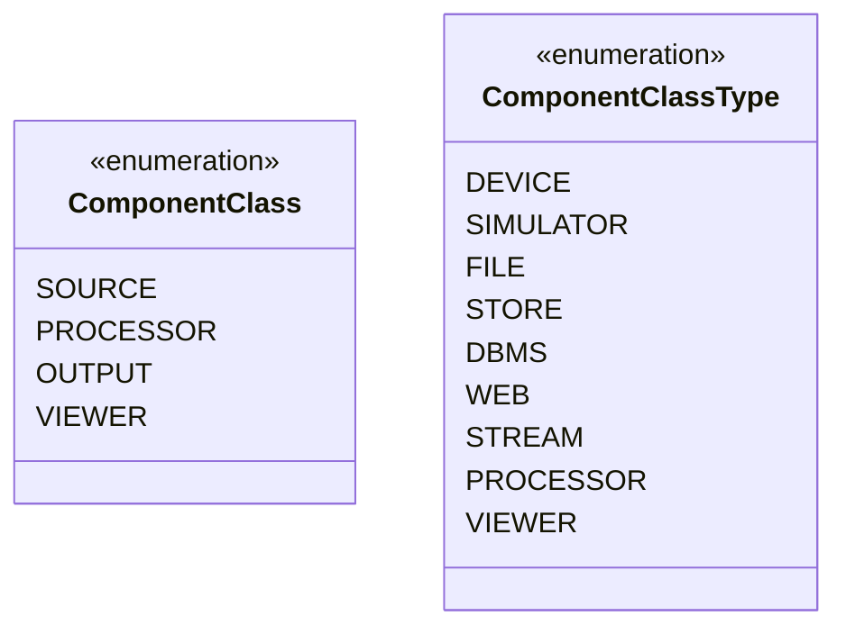
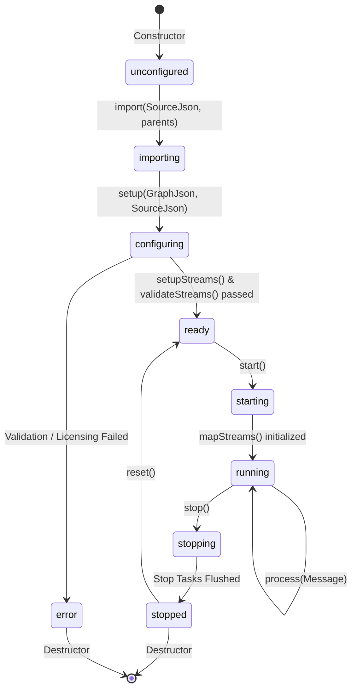
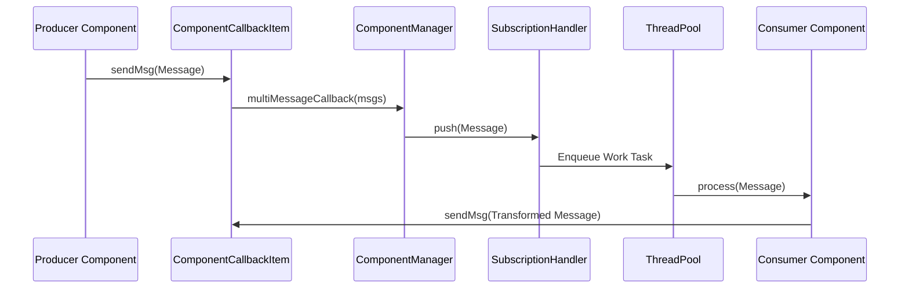

# PhoenixCore Component Architecture & Plugin SDK

## Overview

The `PhoenixCore/Component` module provides the core pipeline execution engine and extensible plugin abstractions for Phoenix. Components represent computational nodes in a directed acyclic data pipeline (DAG) that process, produce, or consume high-throughput telemetry streams.

The component subsystem consists of the following primary classes:

- **[`Component`](#component-base-class)**: Abstract base class defining the component lifecycle, configuration, stream validation, and data processing interfaces.
- **[`componentInfo_t`](#component-metadata--information-json)**: Strongly-typed metadata structure declaring component properties, vendor, class types, licensing requirements, commands, requests, and supported input constraints.
- **[`ComponentCallbackItem`](#component-callbacks)**: Callback interface allowing components to emit telemetry messages, logs, errors, and commands back to the managing engine.
- **[`ComponentSubscriptionHandler`](#subscription-and-data-dispatch)**: High-performance, single-stream FIFO queue and thread-pool dispatcher ensuring ordered data delivery across thread boundaries.
- **[`ComponentManager`](#componentmanager-pipeline-engine)**: Orchestration engine responsible for instantiating components, building subscription routes from [`GraphJson`](GraphJson.md), managing execution thread pools, and monitoring throughput.
- **[`ComponentRemoteManager`](#remote-control--monitoring)**: ZeroMQ-based RPC server enabling remote networked inspection, control, and automation of a running `ComponentManager`.
- **[`StreamTableManager`](#streamtablemanager-stream-centric-configuration)**: Specialized `ComponentManager` that converts stream-centric tabular configurations ([`TableJson`](TableJson.md)) into executable pipeline DAGs ([`GraphJson`](GraphJson.md)).
- **[`ComponentLibrary` & `ComponentAdapter`](#dynamic-plugin-architecture)**: Dynamic plugin architecture enabling runtime discovery and instantiation of component DLLs via the exported `GetComponents` symbol.

```mermaid
graph TD
    subgraph "Application Layer / Graph Configuration"
        GJ["GraphJson / TableJson"] --> CM["ComponentManager"]
        CRM["ComponentRemoteManager (ZMQ)"] <--> CM
    end

    subgraph "Dynamic Library / Factory"
        CLM["ComponentLibraryManager"] -->|Loads DLL| CL["ComponentLibrary (GetComponents)"]
        CL --> CA["ComponentAdapter"]
        CA -->|create()| C["Component Instance"]
    end

    subgraph "Component Execution Engine"
        CM -->|Instantiates| C
        C -->|setCallbackManager| CB["ComponentCallbackItem"]
        CM -->|Wires Stream Routing| SH["ComponentSubscriptionHandler"]
        TP["PhoenixThreadPool"] -->|Executes Tasks| SH
        SH -->|process(Message)| C
        C -->|sendMsg(Message)| CB
        CB -->|Queues Next Stage| SH
    end
```

---

## Component Taxonomy

Every component in Phoenix belongs to a specific functional class and type, declared in its `componentInfo_t`:


```mermaid
classDiagram
    class ComponentClass {
        <<enumeration>>
        SOURCE
        PROCESSOR
        OUTPUT
        VIEWER
    }
    class ComponentClassType {
        <<enumeration>>
        DEVICE
        SIMULATOR
        FILE
        STORE
        DBMS
        WEB
        STREAM
        PROCESSOR
        VIEWER
    }
```

1. **Source (`ComponentClass::SOURCE`)**: Producer of data into the pipeline. Has no required input streams.
   - *Class Types*: `device` (hardware), `file` (flat file playback), `store` (local DB/SQLite), `dbms` (database server), `web` (REST/WebSocket), `stream` (ZeroMQ/network topic), `simulator`.
2. **Processor (`ComponentClass::PROCESSOR`)**: Ingests streams from parent components, performs mathematical or domain-specific transformations, and outputs new streams to child components.
   - *Class Types*: `processor` (e.g., FFT, EU Scalar, Filter, Order Tracking, Matrix Math).
3. **Output (`ComponentClass::OUTPUT`)**: Consumer of data from the pipeline that exports or records data externally.
   - *Class Types*: `file` (file writer), `store` (database writer), `stream` (network transmitter), `device` (hardware control output).
4. **Viewer (`ComponentClass::VIEWER`)**: Consumer specialized for visualization, display caching, and UI telemetry.

---

## Component Lifecycle

The execution lifecycle of a component consists of three distinct phases: **Configuration**, **Setup & Verification**, and **Runtime Streaming**.


```mermaid
stateDiagram-v2
    [*] --> unconfigured: Constructor
    unconfigured --> importing: import(SourceJson, parents)
    importing --> configuring: setup(GraphJson, SourceJson)
    configuring --> ready: setupStreams() & validateStreams() passed
    configuring --> error: Validation / Licensing Failed
    ready --> starting: start()
    starting --> running: mapStreams() initialized
    running --> running: process(Message)
    running --> stopping: stop()
    stopping --> stopped: Stop Tasks Flushed
    stopped --> ready: reset()
    stopped --> [*]: Destructor
    error --> [*]: Destructor
```

### Health Status States

Components publish their internal operational state via the `m_health["status"]` dictionary:

| State | Status String | Description |
|---|---|---|
| **Unconfigured** | `"unconfigured"` | Component instantiated; awaiting graph assignment. |
| **Importing** | `"importing"` | Extracting input/output stream topology from parents or hardware. |
| **Configuring** | `"configuring"` | Parsing component attributes, applying parameters, preparing buffers. |
| **Ready** | `"ready"` | Validation and licensing succeeded; ready to start execution. |
| **Starting** | `"starting"` | Building channel routing tables and acquiring system resources. |
| **Running** | `"running"` | Actively processing streaming telemetry messages. |
| **Stopping** | `"stopping"` | Draining queued message tasks and stopping internal threads. |
| **Stopped** | `"stopped"` | Halted; stream mappings preserved. |
| **Completed** | `"completed"` | Source reader has reached end-of-file / stream end. |
| **Error** | `"error"` | A fatal configuration, licensing, or runtime fault occurred. |

---

## Component Base Class

The `Component` class provides the core virtual interface. Below is the essential class definition:

```cpp
#include <PhoenixCore/PhoenixCoreAPI.h>
#include <PhoenixCore/Component/ComponentInfo.hpp>
#include <PhoenixCore/DataTypes/GraphJson.hpp>
#include <PhoenixCore/DataTypes/Message.hpp>
#include <PhoenixCore/DataTypes/PhoenixComm.hpp>
#include <PhoenixCore/Utilities/EventManager.hpp>

class ComponentCallbackItem;

class Component
{
public:
    struct stream_info_t {
        stream_info_t(GraphJson::StreamJson& sj, uint64_t idx) : idx(idx), streamInfo(sj) {}
        virtual ~stream_info_t() {}
        uint64_t idx;
        GraphJson::StreamJson& streamInfo;
    };

protected:
    std::string m_name;                                             // Unique instance name (UUID)
    std::string m_logicalName;                                      // User display name
    std::string m_type;                                             // Component Type UUID
    uint64_t m_index = 0;                                           // Index in graph source table
    std::shared_ptr<ComponentCallbackItem> m_callbacks = nullptr;   // Manager callback interface
    std::shared_ptr<EventManager> m_eventManager = nullptr;         // System event manager
    std::shared_ptr<const GraphJson> m_graph;                       // Graph pipeline definition
    std::atomic_bool m_started{false};                              // Active processing flag
    std::map<uint32_t, std::list<std::string>> m_chanRef;           // Map: LongID -> Output Stream Names
    std::map<std::string, std::unique_ptr<stream_info_t>> m_streams;// Output stream metadata map
    std::map<std::string, JSON> m_health;                           // Health state dictionary
    std::map<std::string, int> m_featureMap;                        // License tokens required

public:
    Component(std::string name, std::string type);
    virtual ~Component();

    // Lifecycle & Configuration
    virtual bool import(GraphJson::SourceJson& sj, const std::vector<GraphJson::SourceJson>& parents = {});
    virtual bool setup(std::shared_ptr<const GraphJson> graph, GraphJson::SourceJson& srcInfo);
    virtual void start();
    virtual void stop();
    virtual void reset();
    virtual void dataReset();

    // Stream Setup & Validation
    virtual bool setupStreams(GraphJson::SourceJson& sj);
    virtual bool setupStream(GraphJson::StreamJson& sj, uint64_t sidx);
    virtual bool validateStreams(const GraphJson::SourceJson& sj);
    virtual bool validateStream(const GraphJson::StreamJson& sj);
    virtual bool mapStreams();

    // Type Checking
    virtual bool typeCheck(const componentInfo_t& info, const GraphJson::StreamJson& strm) const;
    virtual bool checkUnits(const std::vector<Unit>& unitsInput, const std::vector<componentSupportedInputs_t::unitInfo_t>& unitsSupported) const;
    virtual bool checkDataTypes(const Message::data_types_t& dataTypesInput, const std::vector<Message::data_types_t>& dataTypesSupported) const;
    virtual bool checkMsgTypes(const Message::msg_types_t& msgTypesInput, const std::vector<Message::msg_types_t>& msgTypesSupported) const;

    // Pure Virtuals (Must be implemented)
    virtual void process(const Message &msg) = 0;
    virtual const componentInfo_t& info() = 0;

    // Commands & Requests
    virtual std::vector<std::string> commands() const;
    virtual std::vector<std::string> requests() const;
    virtual PhoenixResponse command(const PhoenixCommand &cmd);
    virtual PhoenixResponse request(const PhoenixRequest &req);

    // Diagnostics & Self-Test
    virtual std::string selfTest() { return "PASSED. Base Class. No Test."; }
};
```

---

## Detailed Step-by-Step Implementation Guide

To create a custom processor or source component, follow these implementation steps.

### Step 1: Define Component Metadata (`componentInfo_t`)

Each component must define a static `componentInfo_t` object describing its capabilities, licensing, commands, and supported input constraints.

```cpp
#include <PhoenixCore/Component/ComponentInfo.hpp>
#include <boost/uuid/string_generator.hpp>

static const std::string CUSTOM_SCALAR_UUID = "39d09444-da10-426c-a8d1-40e605008c15";

inline componentInfo_t createCustomScalarInfo() {
    componentInfo_t info;
    info.setName("Custom Scalar");
    info.setComponentUuid(boost::uuids::string_generator()(CUSTOM_SCALAR_UUID));
    info.setVendor("Apex Turbine");
    info.setDescription("Scales and offsets incoming numeric telemetry streams");
    info.setComponentClass(ComponentClass::PROCESSOR);
    info.setComponentClassType(ComponentClassType::PROCESSOR);
    info.setVersion(phoenixVersion_t(2026, 1, 0));
    info.setFeature("ANALYSIS"); // License feature token
    info.setAttributesFile("CustomScalar_attrs.json");
    info.setHelpFile("CustomScalar.md");
    info.setCommands({"start", "stop", "reset"});
    info.setRequests({"status"});

    // Define supported inputs
    componentSupportedInputs_t inputs;
    inputs.dataTypes = {Message::DATA_FLOATS, Message::DATA_DOUBLES, Message::DATA_WORDS, Message::DATA_DWORDS};
    inputs.msgTypes = {Message::MSG_VECTOR_DATA, Message::MSG_ENTRY};
    
    // Accept any reference domain (time, frequency, etc.) and any data units
    componentSupportedInputs_t::unitInfo_t unitRule;
    unitRule.domain.domainName = ""; // Any primary domain
    unitRule.domain.unitName = "";   // Any unit
    inputs.units.push_back(unitRule);

    info.setSupportedInputs(inputs);
    return info;
}
```

---

### Step 2: Define the Component Settings Schema

Create a JSON Schema file (`CustomScalar_attrs.json`) in the component schemas directory:

```json
{
    "$schema": "http://json-schema.org/draft-07/schema#",
    "definitions": {
        "component_settings": {
            "type": "object",
            "title": "Global Settings",
            "description": "Settings applied globally across all streams in this component",
            "properties": {
                "cs_overall_scalar": {
                    "title": "Global Scalar",
                    "type": "number",
                    "default": 1.0,
                    "description": "Multiplicative gain applied to all streams",
                    "$require_import": false
                },
                "cs_overall_offset": {
                    "title": "Global Offset",
                    "type": "number",
                    "default": 0.0,
                    "description": "Additive bias applied to all streams",
                    "$require_import": false
                }
            }
        },
        "component_stream_settings": {
            "type": "object",
            "title": "Per-Stream Settings",
            "description": "Settings configured on individual stream channels",
            "properties": {
                "cs_stream_scalar": {
                    "title": "Channel Gain",
                    "type": "number",
                    "default": 1.0,
                    "description": "Per-channel scaling override",
                    "$require_import": false
                },
                "cs_stream_offset": {
                    "title": "Channel Offset",
                    "type": "number",
                    "default": 0.0,
                    "description": "Per-channel offset override",
                    "$require_import": false
                }
            }
        }
    }
}
```

> [!NOTE]
> The `$require_import: true` flag tells the UI/pipeline manager that modifying this setting changes the stream topology, requiring a re-invocation of `import()`.

---

### Step 3: Implement the C++ Component Class

```cpp
#include <PhoenixCore/Component/Component.hpp>
#include <PhoenixCore/Utilities/PhoenixJson.hpp>

class CustomScalar : public Component
{
public:
    struct CustomScalarStream : public Component::stream_info_t {
        double scale = 1.0;
        double offset = 0.0;
        CustomScalarStream(GraphJson::StreamJson& sj, uint64_t idx) 
            : stream_info_t(sj, idx) {
            scale = PhoenixJson::getDouble(sj.settings()["cs_stream_scalar"], 1.0);
            offset = PhoenixJson::getDouble(sj.settings()["cs_stream_offset"], 0.0);
        }
    };

private:
    double m_globalScalar = 1.0;
    double m_globalOffset = 0.0;
    static const componentInfo_t s_info;

public:
    CustomScalar(const std::string& name) : Component(name, CUSTOM_SCALAR_UUID) {}
    ~CustomScalar() override { reset(); }

    const componentInfo_t& info() override { return s_info; }

    bool import(GraphJson::SourceJson& sj, const std::vector<GraphJson::SourceJson>& parents) override {
        m_health["status"] = "importing";
        auto srcTmp = sj;
        // Import stream topology from parents
        if (!sj.importStreams(parents)) {
            m_health["status"] = "error";
            return false;
        }
        // Merge preserved stream configurations
        sj << srcTmp;
        m_health["status"] = "unconfigured";
        return true;
    }

    bool setup(std::shared_ptr<const GraphJson> graph, GraphJson::SourceJson& sj) override {
        m_health["status"] = "configuring";
        m_globalScalar = PhoenixJson::getDouble(sj.settings()["cs_overall_scalar"], 1.0);
        m_globalOffset = PhoenixJson::getDouble(sj.settings()["cs_overall_offset"], 0.0);

        if (!Component::setup(graph, sj)) {
            m_health["status"] = "error";
            return false;
        }
        m_health["status"] = "ready";
        return true;
    }

    bool setupStream(GraphJson::StreamJson& strm, uint64_t sidx) override {
        if (!Component::setupStream(strm, sidx)) return false;
        if (strm.isEnabled()) {
            m_streams[strm.name()] = std::make_unique<CustomScalarStream>(strm, sidx);
        } else {
            m_streams[strm.name()] = nullptr;
        }
        return true;
    }

    void process(const Message& msg) override {
        if (!msg.valid() || !m_started) return;

        uint32_t longId = msg.getLongId();
        auto it = m_chanRef.find(longId);
        if (it == m_chanRef.end()) return;

        // Process message for each output stream bound to this incoming channel
        for (const auto& streamName : it->second) {
            auto* sInfo = static_cast<CustomScalarStream*>(m_streams[streamName].get());
            if (!sInfo) continue;

            double totalScale = m_globalScalar * sInfo->scale;
            double totalOffset = m_globalOffset + sInfo->offset;

            // Clone message metadata and headers
            Message outMsg = msg;
            outMsg.setSrcIdx(static_cast<uint16_t>(m_index));
            outMsg.setStreamIdx(static_cast<uint16_t>(sInfo->idx));

            if (msg.getDataType() == Message::DATA_FLOATS) {
                auto inputSpan = msg.getF32Vector();
                outMsg.setSize(static_cast<uint32_t>(inputSpan.size() * sizeof(float)), true);
                float* outPtr = outMsg.getPtr<float>();
                for (size_t i = 0; i < inputSpan.size(); ++i) {
                    outPtr[i] = static_cast<float>(inputSpan[i] * totalScale + totalOffset);
                }
            } else if (msg.getDataType() == Message::DATA_DOUBLES) {
                auto inputSpan = msg.getF64Vector();
                outMsg.setSize(static_cast<uint32_t>(inputSpan.size() * sizeof(double)), true);
                double* outPtr = outMsg.getPtr<double>();
                for (size_t i = 0; i < inputSpan.size(); ++i) {
                    outPtr[i] = inputSpan[i] * totalScale + totalOffset;
                }
            }

            // Dispatch processed message to subscribers
            sendMsg(outMsg);
        }
    }
};

const componentInfo_t CustomScalar::s_info = createCustomScalarInfo();
```

---

### Step 4: Implement the Component Adapter & Export Symbol

To package components into a dynamically loaded DLL/shared library:

```cpp
#include <PhoenixCore/Component/ComponentLibrary.hpp>

class CustomScalarAdapter : public ComponentAdapter
{
public:
    std::shared_ptr<Component> create(const std::string name) const override {
        return std::make_shared<CustomScalar>(name);
    }
    std::string getName() const override { return "Custom Scalar"; }
    std::string getUUID() const override { return CUSTOM_SCALAR_UUID; }
    JSON getInfo() const override { return createCustomScalarInfo(); }
};

// Exported DLL Symbol
extern "C" PHOENIXCORE_API_SYMBOL ComponentLibrary* GetComponents() {
    static ComponentLibrary* s_lib = nullptr;
    if (!s_lib) {
        std::vector<std::shared_ptr<ComponentAdapter>> adapters;
        adapters.push_back(std::make_shared<CustomScalarAdapter>());
        s_lib = new ComponentLibrary("CustomProcessorsLibrary", adapters);
    }
    return s_lib;
}
```

---

## Python Implementation (`PhoenixPy`)

Components can be fully authored and executed in Python using `phoenixpy.component`.

```python
import sys
from phoenixpy import component, message, graphJson, phoenixJson, phoenixLic

class PyGainComponent(component.Component):
    """Custom Python-based gain and offset processor."""
    
    UUID = "789abcde-1234-5678-9abc-def012345678"

    def __init__(self, name: str):
        super().__init__(name, self.UUID)
        self.gain = 2.0
        self.offset = 0.5
        self._info = component.componentInfo_t()
        self._info.setName("Python Gain Processor")
        self._info.setVendor("Apex Turbine")
        self._info.setComponentClass(component.ComponentClass_PROCESSOR)
        self._info.setComponentClassType(component.ComponentClassType_PROCESSOR)
        self._info.setFeature("ANALYSIS")

    def info(self) -> component.componentInfo_t:
        return self._info

    def setup(self, graph: graphJson.GraphJson, srcInfo: graphJson.SourceJson) -> bool:
        settings = srcInfo.settings()
        self.gain = phoenixJson.PhoenixJson.getDouble(settings.getChild("gain"), 2.0)
        self.offset = phoenixJson.PhoenixJson.getDouble(settings.getChild("offset"), 0.0)
        return super().setup(graph, srcInfo)

    def process(self, msg: message.Message) -> None:
        if not msg.valid() or not self.started():
            return
        
        # Read incoming float32 vector
        data = msg.getF32Vector()
        scaled_data = [x * self.gain + self.offset for x in data]
        
        # Construct output message
        out_msg = message.Message(msg)
        out_msg.setSrcIdx(self.index())
        out_msg.setDataType(message.Message.DATA_FLOATS)
        out_msg.setF32Vector(scaled_data)
        
        self.sendMsg(out_msg)

# Usage with ComponentManager
def run_pipeline():
    # Initialize licensing first
    lic = phoenixLic.PhoenixLic.instance()
    lic.setAppInfo("PyPipelineApp", "PyPipelineApp", "2026.1", "localhost", "127.0.0.1", 0)
    err = lic.connect()
    if err:
        print(f"Licensing failed: {err}")
        return

    mgr = component.ComponentManager("MainEngine", True, 4)
    proc = PyGainComponent("gain_node_1")
    
    # Register and wire within graph...
    print("Python component instantiated and ready.")
```

---

## ComponentManager & Stream Routing

The `ComponentManager` executes the computational graph. It constructs `ComponentSubscriptionHandler` instances for each connected stream channel:


```mermaid
sequenceDiagram
    participant P as Producer Component
    participant CB as ComponentCallbackItem
    participant CM as ComponentManager
    participant SH as SubscriptionHandler
    participant TP as ThreadPool
    participant C as Consumer Component

    P->>CB: sendMsg(Message)
    CB->>CM: multiMessageCallback(msgs)
    CM->>SH: push(Message)
    SH->>TP: Enqueue Work Task
    TP->>C: process(Message)
    C->>CB: sendMsg(Transformed Message)
```

### Multithreaded Execution Rules

1. **Independent Channel Streams**: Each stream subscription handler maintains its own FIFO queue. Tasks for different streams execute concurrently across the thread pool.
2. **Serial Execution Per Stream**: A single `ComponentSubscriptionHandler` guarantees that data items for the *same* stream are processed strictly in order.
3. **Thread Safety in `process()`**: If a component combines multiple streams (e.g. `SignalMath` adding Channel A and Channel B), it **must** synchronize internal buffers using `std::mutex` or lock-free data structures.

---

## Automations & Conditions

Components support rule-based event monitoring and actions through the `Condition` and `Automation` subsystems:

- **[`Condition`](Utilities.md#condition-system)**: Evaluates incoming streaming messages against thresholds, limit states (`GOOD`, `WARN`, `ALERT`), or expressions.
- **[`Automation`](Utilities.md#automation-system)**: Executes responsive actions (e.g., triggering a snapshot recording, setting digital outputs, sending alerts) when associated conditions evaluate to `true`.

---

## Reference Checklist for Plugin Developers

When implementing a new PhoenixCore component plugin:

- [ ] Generate a unique RFC 4122 Version 4 UUID for the component type.
- [ ] Implement `info()` returning a fully populated `componentInfo_t`.
- [ ] Create a JSON Schema for component settings (`_attrs.json`).
- [ ] Override `import()` to populate and validate stream metadata from parents or hardware.
- [ ] Override `setupStream()` to instantiate custom `stream_info_t` structures.
- [ ] Override `process()` to handle incoming `Message` payloads and dispatch via `sendMsg()`.
- [ ] Implement `ComponentAdapter` and export the `GetComponents()` function.
- [ ] Verify licensing checkout (`m_featureMap`) during setup and runtime.
