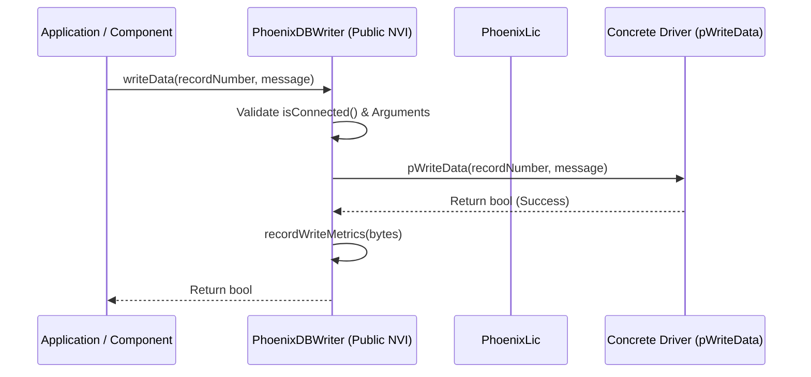

# PhoenixCore Database Interface & Plugin SDK

## Overview

The `PhoenixCore/Database` module defines a unified database access abstraction layer for telemetry data, event logs, error tracking, and digital twin model state storage. It provides standard base classes for reading from and writing to telemetry databases, database migration tools, and dynamic plugin loading via `DatabaseLibrary`.

The database subsystem consists of the following key interfaces and classes:

- **[`PhoenixDBConnection`](#phoenixdbconnection-base-interface)**: Base connection interface defining connection lifecycles, schema queries (`hasTable`, `hasView`, `hasIndex`), query creation (`createQuery`), database health checks, optimization, and migrations.
- **[`PhoenixDBReader`](#phoenixdbreader-interface)**: Abstract read interface providing telemetry retrieval, record discovery, event parsing, and query initialization.
- **[`PhoenixDBWriter`](#phoenixdbwriter-interface)**: Abstract write interface handling transactions, table creation, high-throughput message ingestion, event persistence, and model state blobs.
- **[`DBQuery`](#dbquery-abstraction)**: Prepared statement and query execution abstraction for cursor navigation and column data decoding.
- **[`databaseReaderInfo_t` & `databaseWriterInfo_t`](#database-metadata--information-structures)**: Metadata structures declaring database driver capabilities, URI schemes, versioning, attributes, and licensing features.
- **[`PhoenixDBAdapter` & `DatabaseLibrary`](#dynamic-plugin-architecture)**: Adapter and dynamic library container loaded via the exported `GetDatabases` symbol.

```mermaid
graph TD
    subgraph "Application / Component Layer"
        SRC["Database Source Component"] -->|Reads via| RDR["PhoenixDBReader"]
        OUT["Database Output Component"] -->|Writes via| WTR["PhoenixDBWriter"]
    end

    subgraph "Database Abstraction Layer"
        RDR -->|Inherits| CONN["PhoenixDBConnection"]
        WTR -->|Inherits| CONN
        CONN -->|Creates| QRY["DBQuery"]
        RDR -->|Dispatches via| CB["PhoenixDBReaderCallbackItem"]
    end

    subgraph "Dynamic Library / Plugin Loading"
        DLM["DatabaseLibraryManager"] -->|Loads DLL (GetDatabases)| DL["DatabaseLibrary"]
        DL --> DBA["PhoenixDBAdapter"]
        DBA -->|createReader()| RDR
        DBA -->|createWriter()| WTR
    end

    subgraph "Database Driver Implementations"
        SQLITE["SQLite Plugin"] -.->|Implements| DBA
        PG["PostgreSQL Plugin"] -.->|Implements| DBA
        TS["TimescaleDB Plugin"] -.->|Implements| DBA
    end
```

---

## Non-Virtual Interface (NVI) Architecture

The database classes follow the **Public Non-Virtual Interface (NVI)** design pattern:
- **Public methods** (e.g., `connect()`, `getRecords()`, `writeData()`, `beginWrite()`) perform invariant state checks, license checkouts/checkins, error logging, and performance metrics tracking.
- **Protected virtual methods** (prefixed with `p*`, e.g., `pConnect()`, `pGetRecords()`, `pWriteData()`, `pBeginWrite()`) are overridden by driver implementations.



---

## Core Classes & Interfaces

### PhoenixDBConnection Base Interface

The base interface for all database connection handles:

```cpp
#include <PhoenixCore/PhoenixCoreAPI.h>
#include <PhoenixCore/Utilities/PhoenixJson.hpp>
#include <PhoenixCore/Database/DatabaseHealth.hpp>
#include <PhoenixCore/Database/DBQuery.hpp>
#include <boost/uuid/uuid.hpp>

class PhoenixDBConnection
{
public:
    PhoenixDBConnection();
    virtual ~PhoenixDBConnection();

    virtual void connect(const std::string& uri, const JSON& options = JSON::object()) = 0;
    virtual void disconnect() = 0;
    virtual bool isConnected() const = 0;
    virtual bool hasTable(const std::string& tableName) const = 0;
    virtual bool hasView(const std::string& viewName) const = 0;
    virtual bool hasIndex(const std::string& indexName) const = 0;
    virtual void optimize() = 0;
    virtual dbHealth_t healthCheck() = 0;
    virtual void vacuum() = 0;
    virtual void migrate(const std::string& migrationSql) = 0;
    virtual std::shared_ptr<DBQuery> createQuery(const std::string& sqlQuery) = 0;
    
    boost::uuids::uuid getUUID() const { return m_uuid; }

protected:
    boost::uuids::uuid m_uuid;
    bool m_isConnected = false;
};
```

---

### PhoenixDBReader Interface

`PhoenixDBReader` reads telemetry, records, and events from a database instance:

```cpp
#include <PhoenixCore/Database/PhoenixDBConnection.hpp>
#include <PhoenixCore/DataTypes/RecordInfo.hpp>
#include <PhoenixCore/DataTypes/EventInfo.hpp>
#include <PhoenixCore/Database/DatabaseInfo.hpp>

class PhoenixDBReaderCallbackItem;

class PhoenixDBReader : public PhoenixDBConnection
{
public:
    PhoenixDBReader();
    virtual ~PhoenixDBReader();

    // Public NVI Methods
    void connect(const std::string& uri, const JSON& options = JSON::object()) override;
    void disconnect() override;
    bool isConnected() const override;

    std::vector<RecordInfo_t> getRecords(uint64_t startTime = 0, uint64_t endTime = static_cast<uint64_t>(-1));
    std::vector<eventInfo_t> getEvents(uint64_t recordNumber);
    uint64_t getFirstTime(uint64_t recordNumber);
    uint64_t getLastTime(uint64_t recordNumber);

    // Query Initializers
    std::shared_ptr<DBQuery> initDataTableRead(uint64_t recordNumber, uint64_t starttime = 0, uint64_t endtime = static_cast<uint64_t>(-1),
                                               size_t src = static_cast<size_t>(-1), size_t stream = static_cast<size_t>(-1));
    std::shared_ptr<DBQuery> initDataTableRead(uint64_t recordNumber, uint64_t starttime, uint64_t endtime,
                                               const std::vector<std::pair<uint16_t, uint16_t>>& streams);
    std::shared_ptr<DBQuery> initLogsRead(uint64_t recordNumber, uint64_t starttime = 0, uint64_t endtime = static_cast<uint64_t>(-1));
    std::shared_ptr<DBQuery> initErrorsRead(uint64_t recordNumber, uint64_t starttime = 0, uint64_t endtime = static_cast<uint64_t>(-1));
    std::shared_ptr<DBQuery> initEventRead(uint64_t recordNumber);

    DBQuery::Status executeQuery(std::shared_ptr<DBQuery> query);
    databaseReaderInfo_t getReaderInfo() const;
    void setCallback(const std::shared_ptr<PhoenixDBReaderCallbackItem>& cb);

protected:
    // Protected Virtual Hooks (p*)
    virtual void pConnect(const std::string& uri, const JSON& options) = 0;
    virtual void pDisconnect() = 0;
    virtual bool pHasTable(const std::string& tableName) const = 0;
    virtual bool pHasView(const std::string& viewName) const = 0;
    virtual bool pHasIndex(const std::string& indexName) const = 0;

    virtual std::vector<RecordInfo_t> pGetRecords(uint64_t startTime, uint64_t endTime) = 0;
    virtual std::vector<eventInfo_t> pGetEvents(uint64_t recordNumber) = 0;
    virtual uint64_t pGetFirstTime(uint64_t recordNumber) = 0;
    virtual uint64_t pGetLastTime(uint64_t recordNumber) = 0;

    virtual std::shared_ptr<DBQuery> pInitDataTableRead(uint64_t recordNumber, uint64_t starttime, uint64_t endtime, size_t src, size_t stream) = 0;
    virtual std::shared_ptr<DBQuery> pInitLogsRead(uint64_t recordNumber, uint64_t starttime, uint64_t endtime) = 0;
    virtual std::shared_ptr<DBQuery> pInitErrorsRead(uint64_t recordNumber, uint64_t starttime, uint64_t endtime) = 0;
    virtual std::shared_ptr<DBQuery> pInitEventRead(uint64_t recordNumber) = 0;
    virtual std::shared_ptr<DBQuery> pCreateQuery(const std::string& sqlQuery) = 0;
    virtual databaseReaderInfo_t pGetReaderInfo() const = 0;
    virtual void pOptimize() = 0;
    virtual dbHealth_t pHealthCheck() = 0;
    virtual void pVacuum() = 0;
    virtual void pMigrate(const std::string& migrationSql) = 0;
};
```

---

### PhoenixDBWriter Interface

`PhoenixDBWriter` handles high-speed telemetry recording, log/error capture, and event persistence:

```cpp
#include <PhoenixCore/Database/PhoenixDBConnection.hpp>
#include <PhoenixCore/DataTypes/Message.hpp>
#include <PhoenixCore/DataTypes/RecordInfo.hpp>
#include <PhoenixCore/DataTypes/EventInfo.hpp>
#include <PhoenixCore/Database/DBConnectionUtils.hpp>

class PhoenixDBWriter : public PhoenixDBConnection
{
public:
    PhoenixDBWriter();
    virtual ~PhoenixDBWriter();

    // Transactions
    bool beginWrite(const DBConnectionUtils::executionType_t& etype = DBConnectionUtils::QRY_EXEC_DEFAULT);
    bool endWrite();

    // Table Creation & Data Ingestion
    void makeTables(const std::vector<std::pair<RecordTableType, std::string>>& tables);
    size_t writeRecord(const RecordInfo_t& recordInfo); // Returns assigned record ID
    bool updateRecord(const RecordInfo_t& recordInfo);
    bool writeData(uint64_t recordNumber, const Message& message);
    bool writeLog(uint64_t recordNumber, size_t sourceIndex, size_t streamIndex, uint64_t timestamp, const std::string& message);
    bool writeError(uint64_t recordNumber, size_t sourceIndex, size_t streamIndex, uint64_t timestamp, const std::string& message, int errorLevel, int errorLocation);
    bool writeEvent(const eventInfo_t& eventInfo);
    bool writeModelData(uint64_t recordNumber, size_t sourceIndex, size_t streamIndex, uint64_t startTime, uint64_t endTime, const std::string& modelBlob);

    // Monitoring Metrics
    uint64_t getBytesWritten() const;
    uint64_t getWriteDuration() const;
    void resetWriteDuration();

    databaseWriterInfo_t getWriterInfo() const;

protected:
    virtual bool pBeginWrite(const DBConnectionUtils::executionType_t& etype) = 0;
    virtual bool pEndWrite() = 0;
    virtual void pMakeTables(const std::vector<std::pair<RecordTableType, std::string>>& tables) = 0;
    virtual size_t pWriteRecord(const RecordInfo_t& recordInfo) = 0;
    virtual bool pUpdateRecord(const RecordInfo_t& recordInfo) = 0;
    virtual bool pWriteData(uint64_t recordNumber, const Message& message) = 0;
    virtual bool pWriteLog(uint64_t recordNumber, size_t sourceIndex, size_t streamIndex, uint64_t timestamp, const std::string& message) = 0;
    virtual bool pWriteError(uint64_t recordNumber, size_t sourceIndex, size_t streamIndex, uint64_t timestamp, const std::string& message, int errorLevel, int errorLocation) = 0;
    virtual bool pWriteEvent(const eventInfo_t& eventInfo) = 0;
    virtual bool pWriteModelData(uint64_t recordNumber, size_t sourceIndex, size_t streamIndex, uint64_t startTime, uint64_t endTime, const std::string& modelBlob) = 0;
    virtual databaseWriterInfo_t pGetWriterInfo() const = 0;
};
```

---

## Database Metadata & Information Structures

Database drivers declare their capabilities using `databaseReaderInfo_t` and `databaseWriterInfo_t`:

```cpp
struct databaseReaderInfo_t {
    std::string name;                          // Driver name (e.g., "SQLite Reader", "PostgreSQL Reader")
    boost::uuids::uuid uuid;                   // Driver UUID
    std::vector<std::string> supportedProtocols;// e.g., ["sqlite", "file", "postgresql", "timescale"]
    std::string description;
    std::string feature;                       // Apex license feature name (e.g., "custom-reader")
    phoenixVersion_t version;
    std::string attributesFile;                // Schema attributes JSON path
    std::string queryType;                     // "sql", "nosql", "timeseries"
};

struct databaseWriterInfo_t {
    std::string name;                          // Driver name (e.g., "SQLite Writer")
    boost::uuids::uuid uuid;
    std::vector<std::string> supportedProtocols;
    std::string description;
    std::string feature;                       // Apex license feature name (e.g., "custom-writer")
    phoenixVersion_t version;
    std::string attributesFile;
    std::string queryType;
};
```

---

## Step-by-Step Plugin Implementation Guide

### Step 1: Implement Custom Reader and Writer Classes

```cpp
#include <PhoenixCore/Database/PhoenixDBReader.hpp>
#include <PhoenixCore/Database/PhoenixDBWriter.hpp>
#include <PhoenixCore/Database/DatabaseLibrary.hpp>
#include <boost/uuid/string_generator.hpp>

static const std::string SQLITE_READER_UUID = "4a123456-789a-bcde-f012-3456789abcde";
static const std::string SQLITE_WRITER_UUID = "4a123456-789a-bcde-f012-3456789abcdf";

class CustomSQLiteReader : public PhoenixDBReader
{
protected:
    void pConnect(const std::string& uri, const JSON& options) override {
        // Open SQLite database at file path uri
    }
    void pDisconnect() override {
        // Close SQLite db connection
    }
    bool pHasTable(const std::string& tableName) const override {
        return true; // Execute schema query
    }
    bool pHasView(const std::string& viewName) const override { return false; }
    bool pHasIndex(const std::string& indexName) const override { return true; }

    std::vector<RecordInfo_t> pGetRecords(uint64_t startTime, uint64_t endTime) override {
        std::vector<RecordInfo_t> records;
        // Query APEX_RECORDS table
        return records;
    }

    std::vector<eventInfo_t> pGetEvents(uint64_t recordNumber) override {
        std::vector<eventInfo_t> events;
        // Query APEX_EVENTS table
        return events;
    }

    uint64_t pGetFirstTime(uint64_t recordNumber) override { return 1000000000ULL; }
    uint64_t pGetLastTime(uint64_t recordNumber) override { return 2000000000ULL; }

    std::shared_ptr<DBQuery> pInitDataTableRead(uint64_t recordNumber, uint64_t starttime, uint64_t endtime, size_t src, size_t stream) override {
        // Construct and return prepared DBQuery
        return nullptr;
    }
    std::shared_ptr<DBQuery> pInitLogsRead(uint64_t recordNumber, uint64_t starttime, uint64_t endtime) override { return nullptr; }
    std::shared_ptr<DBQuery> pInitErrorsRead(uint64_t recordNumber, uint64_t starttime, uint64_t endtime) override { return nullptr; }
    std::shared_ptr<DBQuery> pInitEventRead(uint64_t recordNumber) override { return nullptr; }
    std::shared_ptr<DBQuery> pCreateQuery(const std::string& sqlQuery) override { return nullptr; }

    databaseReaderInfo_t pGetReaderInfo() const override {
        databaseReaderInfo_t info;
        info.name = "Custom SQLite Reader";
        info.uuid = boost::uuids::string_generator()(SQLITE_READER_UUID);
        info.supportedProtocols = {"sqlite", "file"};
        info.feature = "custom-reader";
        info.queryType = "sql";
        return info;
    }

    void pOptimize() override {}
    dbHealth_t pHealthCheck() override { return dbHealth_t{}; }
    void pVacuum() override {}
    void pMigrate(const std::string& migrationSql) override {}
};
```

---

### Step 2: Implement the Database Adapter and DLL Entry Point

```cpp
class CustomSQLiteAdapter : public PhoenixDBAdapter
{
public:
    std::shared_ptr<PhoenixDBReader> createReader() override {
        return std::make_shared<CustomSQLiteReader>();
    }
    std::shared_ptr<PhoenixDBWriter> createWriter() override {
        return nullptr; // Or return CustomSQLiteWriter instance
    }
    std::string getReaderName() const override { return "Custom SQLite Reader"; }
    std::string getReaderUUID() const override { return SQLITE_READER_UUID; }
    bool hasReader() const override { return true; }
    bool hasWriter() const override { return false; }
};

// Main dynamic library export symbol
extern "C" PHOENIXCORE_API_SYMBOL DatabaseLibrary* GetDatabases() {
    static DatabaseLibrary* s_lib = nullptr;
    if (!s_lib) {
        std::vector<std::shared_ptr<PhoenixDBAdapter>> adapters;
        adapters.push_back(std::make_shared<CustomSQLiteAdapter>());
        s_lib = new DatabaseLibrary("CustomSQLiteDatabaseLibrary", adapters);
    }
    return s_lib;
}
```

---

## Python Usage (`PhoenixPy`)

Database operations can be performed directly from Python using `phoenixpy.database`:

```python
from phoenixpy import database, phoenixLic

def inspect_database_records():
    # 1. Initialize license
    lic = phoenixLic.PhoenixLic.instance()
    lic.setAppInfo("PyDBApp", "PyDBApp", "2026.1", "localhost", "127.0.0.1", 0)
    lic.connect()

    # 2. Get Database Library Manager & Load Drivers
    db_mgr = database.getDatabaseLibraryManager()
    db_mgr.loadLibraries("plugins/database")

    # 3. Create Reader Instance
    adapters = db_mgr.getAdapters()
    reader = None
    for adapter in adapters:
        if "sqlite" in adapter.getReaderInfo().supportedProtocols:
            reader = adapter.createReader()
            break

    if not reader:
        print("No SQLite reader driver found!")
        return

    # 4. Connect and Read Records
    reader.connect("sqlite:///data/test_run_01.dxdb")
    if reader.isConnected():
        records = reader.getRecords()
        print(f"Discovered {len(records)} test records.")
        for r in records:
            print(f"Record #{r.record_id}: Start={r.record_start}, End={r.record_complete}")
        
        reader.disconnect()

if __name__ == "__main__":
    inspect_database_records()
```

---

## Summary Checklist for Database Plugin Implementers

- [ ] Inherit from `PhoenixDBReader` or `PhoenixDBWriter`.
- [ ] Implement all protected virtual `p*` methods (`pConnect`, `pDisconnect`, `pGetRecords`, `pWriteData`, etc.).
- [ ] Define `databaseReaderInfo_t` / `databaseWriterInfo_t` with supported URI protocols and feature token.
- [ ] Create `PhoenixDBAdapter` wrapping your reader and writer.
- [ ] Export the `GetDatabases` C symbol returning a `DatabaseLibrary` pointer.
