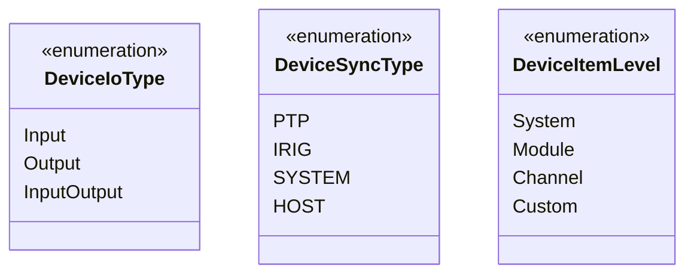
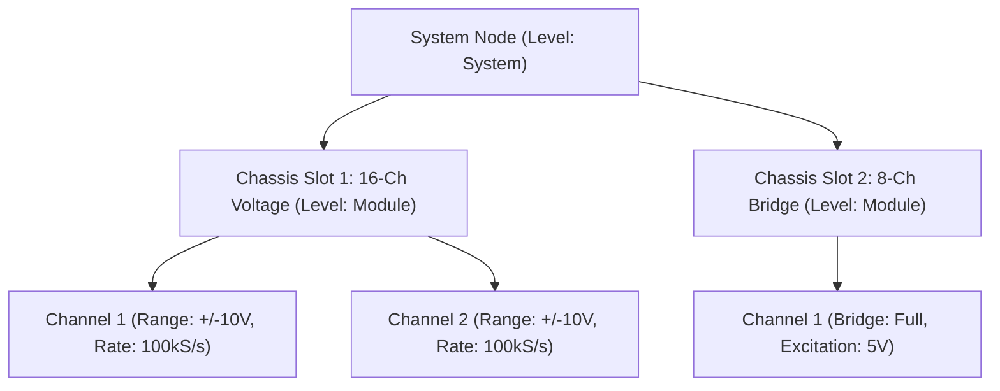

# PhoenixCore Device Interface & Hardware Plugin SDK

## Overview

The `PhoenixCore/Device` module provides a unified, hardware-agnostic base class interface for interacting with acquisition and control devices. It abstracts the complexities of hardware communication protocols (TCP/IP, UDP, Serial, REST, PCIe, USB, PXI) while enabling high-throughput streaming into the Phoenix data pipeline.

The device subsystem consists of the following primary components:

- **[`Device`](#device-base-class)**: Abstract base class implementing the Non-Virtual Interface (NVI) pattern for connection management, streaming, output writing, and hardware configuration.
- **[`deviceInfo_t`](#deviceinfo_t-metadata)**: Descriptive metadata declaring device type UUID, supported protocols, I/O type, licensing feature, and attributes.
- **[`deviceItem_t` & `deviceSetting_t`](#hierarchical-device-tree--settings)**: Agnostic, recursive tree structure modeling physical hardware hierarchies (System → Module → Channel → Custom) and typed settings.
- **[`DeviceLibrary` & `DeviceAdapter`](#dynamic-plugin-architecture)**: Dynamic plugin architecture enabling runtime discovery and instantiation of device drivers via the exported `GetDevices` symbol.

```mermaid
graph TD
    subgraph "Application & Graph Engine"
        DSRC["Device Source Component"] -->|Uses| DEV["Device (NVI Interface)"]
        DOUT["Device Output Component"] -->|Uses| DEV
    end

    subgraph "Device Base Class (NVI Pattern)"
        DEV -->|Input Mode| STRM["Data Streaming Callback"]
        DEV -->|Output Mode| WTR["write(Message) Output Mapping"]
        DEV -->|Settings Hierarchy| TREE["deviceItem_t Tree"]
    end

    subgraph "Dynamic Library / Factory"
        DLM["DeviceLibraryManager"] -->|Loads DLL (GetDevices)| DL["DeviceLibrary"]
        DL --> DA["DeviceAdapter"]
        DA -->|createDevice()| DEV
    end

    subgraph "Hardware Drivers"
        MC["MeCalc Driver"] -.->|Implements| DA
        SV["Scanivalve Driver"] -.->|Implements| DA
        NI["NI DAQ Driver"] -.->|Implements| DA
    end
```

---

## Device I/O & Synchronization Types

Devices are categorized by their data flow capabilities and time-synchronization mechanisms:



### Device I/O Types (`DeviceIoType`)
- **`Input`**: Data producer (e.g. pressure scanner, accelerometer digitizer, dynamic strain bridge).
- **`Output`**: Data consumer/actuator (e.g. analog output card, function generator, digital relay controller).
- **`InputOutput`**: Bidirectional hardware capable of concurrent sampling and generation.

### Device Synchronization Types (`DeviceSyncType`)
- **`PTP`**: IEEE 1588 Precision Time Protocol master/slave synchronization.
- **`IRIG`**: IRIG-B timecode synchronization from GPS/timing receiver.
- **`SYSTEM`**: Common hardware sync bus / clock pulse across chassis backplane.
- **`HOST`**: Software timestamping referenced to host PC clock.

---

## Hierarchical Device Tree & Settings

Rather than flattening hardware parameters into an arbitrary list, Phoenix models device layouts using a hierarchical tree of `deviceItem_t` nodes:



### Structure Definitions

```cpp
enum class DeviceItemLevel { System, Module, Channel, Custom };

struct deviceSetting_t {
    std::string name;              // Parameter key (e.g., "sample_rate", "coupling", "range")
    std::string type;              // "string", "double", "int64", "boolean", "enumeration"
    bool isReadOnly = false;       // True for telemetry/diagnostics
    nlohmann::json value;          // Current setting value
    nlohmann::json supportedValues;// Valid options or range constraints
};

struct deviceItem_t {
    std::string id;                // Unique ID (e.g., "sys_0", "mod_1", "mod_1_chan_0")
    std::string name;              // Display name
    DeviceItemLevel level;         // System, Module, Channel, or Custom
    std::vector<deviceSetting_t> settings;
    std::vector<deviceItem_t> children;
};
```

---

## Device Base Class

```cpp
#include <PhoenixCore/PhoenixCoreAPI.h>
#include <PhoenixCore/DataTypes/Message.hpp>
#include <PhoenixCore/DataTypes/GraphJson.hpp>
#include <PhoenixCore/Device/DeviceInfo.hpp>

class Device
{
public:
    using DataCallback_t = std::function<void(const Message&)>;

    Device();
    virtual ~Device();

    // Connection Lifecycle
    void connect(const std::string& uri, const nlohmann::json& options = nlohmann::json::object());
    void disconnect();
    bool isConnected() const;

    // Device Identity
    deviceInfo_t getDeviceInfo() const;
    boost::uuids::uuid getUUID() const; // Per-instance UUID
    void setSrcIndex(uint16_t idx);
    uint16_t getSrcIndex() const;

    // Hierarchical Settings
    deviceItem_t getDeviceStructure() const;
    void applySettings(const deviceItem_t& settingsTree);
    void applyItemSettings(const std::string& itemId, const std::vector<deviceSetting_t>& settings, bool reloadAfterPush = true);
    void applyItemSetting(const std::string& itemId, const deviceSetting_t& setting, bool reloadAfterPush = true);

    // Input Streaming
    void startStreaming();
    void stopStreaming();
    bool isStreaming() const;
    void setDataCallback(DataCallback_t callback);
    std::vector<GraphJson::StreamJson> getStreams() const;
    std::vector<GraphJson::StreamJson> getHealthStreams() const;

    // Output Writing
    void setOutputStreams(const std::vector<outputStreamBinding_t>& bindings);
    void write(const Message& msg);

protected:
    // Protected Virtual Hooks (p*)
    virtual void pConnect(const std::string& uri, const nlohmann::json& options) = 0;
    virtual void pDisconnect() = 0;
    virtual deviceInfo_t pGetDeviceInfo() const = 0;
    virtual deviceItem_t pGetDeviceStructure() const = 0;
    virtual void pApplySettings(const deviceItem_t& settingsTree) = 0;
    virtual void pStartStreaming() = 0;
    virtual void pStopStreaming() = 0;
    virtual std::vector<GraphJson::StreamJson> pGetStreams() const = 0;
    virtual void pSetOutputStreams(const std::vector<outputStreamBinding_t>& bindings) {}
    virtual void pWrite(const Message& msg) {}
};
```

---

## Step-by-Step Device Plugin Walkthrough

### Step 1: Implement the Concrete Device Class

```cpp
#include <PhoenixCore/Device/Device.hpp>
#include <boost/uuid/string_generator.hpp>

static const std::string MOCK_DEVICE_UUID = "5b123456-789a-bcde-f012-3456789abcde";

class CustomDAQDevice : public Device
{
private:
    std::atomic_bool m_streaming{false};
    std::thread m_workerThread;
    double m_sampleRate = 10000.0;

protected:
    void pConnect(const std::string& uri, const nlohmann::json& options) override {
        // Connect to hardware via IP / COM port in uri
    }

    void pDisconnect() override {
        pStopStreaming();
        // Close sockets / handles
    }

    deviceInfo_t pGetDeviceInfo() const override {
        deviceInfo_t info;
        info.name = "Custom High-Speed DAQ";
        info.uuid = boost::uuids::string_generator()(MOCK_DEVICE_UUID);
        info.supportedProtocols = {"tcp", "udp", "usb"};
        info.ioType = DeviceIoType::Input;
        info.feature = "custom-device";
        info.version = phoenixVersion_t(2026, 1, 0);
        return info;
    }

    deviceItem_t pGetDeviceStructure() const override {
        deviceItem_t sys;
        sys.id = "sys_0";
        sys.name = "Custom DAQ Chassis";
        sys.level = DeviceItemLevel::System;

        deviceSetting_t rateSetting;
        rateSetting.name = "sample_rate";
        rateSetting.type = "double";
        rateSetting.value = m_sampleRate;
        sys.settings.push_back(rateSetting);

        // Add Channels
        for (int i = 0; i < 4; ++i) {
            deviceItem_t ch;
            ch.id = "chan_" + std::to_string(i);
            ch.name = "Analog In " + std::to_string(i + 1);
            ch.level = DeviceItemLevel::Channel;
            sys.children.push_back(ch);
        }
        return sys;
    }

    void pApplySettings(const deviceItem_t& tree) override {
        for (const auto& s : tree.settings) {
            if (s.name == "sample_rate") {
                m_sampleRate = s.value.get<double>();
            }
        }
    }

    std::vector<GraphJson::StreamJson> pGetStreams() const override {
        std::vector<GraphJson::StreamJson> streams;
        for (int i = 0; i < 4; ++i) {
            GraphJson::StreamJson strm;
            strm.name() = "DAQ/Chan" + std::to_string(i);
            strm.logicalName() = "Channel " + std::to_string(i + 1);
            strm.mtype() = "vector";
            strm.dtype() = "number_32";
            strm.delta() = 1.0 / m_sampleRate;
            strm.uniform() = true;
            strm.continuous() = true;
            streams.push_back(strm);
        }
        return streams;
    }

    void pStartStreaming() override {
        if (m_streaming) return;
        m_streaming = true;
        m_workerThread = std::thread([this]() {
            while (m_streaming) {
                // Simulate acquiring 100 samples per channel
                for (uint16_t ch = 0; ch < 4; ++ch) {
                    Message msg;
                    msg.setSrcIdx(getSrcIndex());
                    msg.setStreamIdx(ch);
                    msg.setDataType(Message::DATA_FLOATS);
                    msg.setMessageType(Message::MSG_VECTOR_DATA);
                    msg.setTimeNano(std::chrono::duration_cast<std::chrono::nanoseconds>(
                        std::chrono::system_clock::now().time_since_epoch()).count());
                    
                    std::vector<float> samples(100, 1.23f);
                    msg.setF32Vector(samples);

                    // Dispatch via callback
                    if (m_dataCallback) {
                        m_dataCallback(msg);
                    }
                }
                std::this_thread::sleep_for(std::chrono::milliseconds(10));
            }
        });
    }

    void pStopStreaming() override {
        m_streaming = false;
        if (m_workerThread.joinable()) {
            m_workerThread.join();
        }
    }
};
```

---

### Step 2: Implement Adapter & Export DLL Symbol

```cpp
#include <PhoenixCore/Device/DeviceLibrary.hpp>

class CustomDAQAdapter : public DeviceAdapter
{
public:
    std::shared_ptr<Device> createDevice() override {
        return std::make_shared<CustomDAQDevice>();
    }
    std::string getDeviceName() const override { return "Custom High-Speed DAQ"; }
    std::string getDeviceUUID() const override { return MOCK_DEVICE_UUID; }
    deviceInfo_t getDeviceInfo() const override {
        return CustomDAQDevice().getDeviceInfo();
    }
};

extern "C" PHOENIXCORE_API_SYMBOL DeviceLibrary* GetDevices() {
    static DeviceLibrary* s_lib = nullptr;
    if (!s_lib) {
        std::vector<std::shared_ptr<DeviceAdapter>> adapters;
        adapters.push_back(std::make_shared<CustomDAQAdapter>());
        s_lib = new DeviceLibrary("CustomDAQDeviceLibrary", adapters);
    }
    return s_lib;
}
```

---

## Python Usage (`PhoenixPy`)

```python
from phoenixpy import device, phoenixLic
import time

def capture_hardware_telemetry():
    # 1. Initialize licensing
    lic = phoenixLic.PhoenixLic.instance()
    lic.setAppInfo("PyDeviceApp", "PyDeviceApp", "2026.1", "localhost", "127.0.0.1", 0)
    lic.connect()

    # 2. Load device drivers
    dev_mgr = device.getDeviceLibraryManager()
    dev_mgr.loadLibraries("plugins/devices")

    # 3. Instantiate device
    adapters = dev_mgr.getAdapters()
    daq_device = adapters[0].createDevice()

    # 4. Connect and configure
    daq_device.connect("tcp://192.168.1.100:5000")
    print("Device connected:", daq_device.isConnected())

    structure = daq_device.getDeviceStructure()
    print("Chassis Name:", structure.name)

    # 5. Attach data callback
    def on_data_received(msg):
        print(f"Received Message from Stream #{msg.getStreamIdx()}, Size={msg.getSize()} bytes")

    daq_device.setDataCallback(on_data_received)

    # 6. Stream data
    daq_device.startStreaming()
    time.sleep(2.0)
    daq_device.stopStreaming()
    daq_device.disconnect()

if __name__ == "__main__":
    capture_hardware_telemetry()
```

---

## Implementation Checklist for Hardware Developers

- [ ] Subclass `Device` and implement all `p*` virtual methods.
- [ ] Construct the `deviceItem_t` hardware layout tree in `pGetDeviceStructure()`.
- [ ] Implement `pApplySettings()` to handle configuration changes.
- [ ] Emit streaming telemetry via `m_dataCallback(msg)`.
- [ ] Create `DeviceAdapter` and export `GetDevices`.
