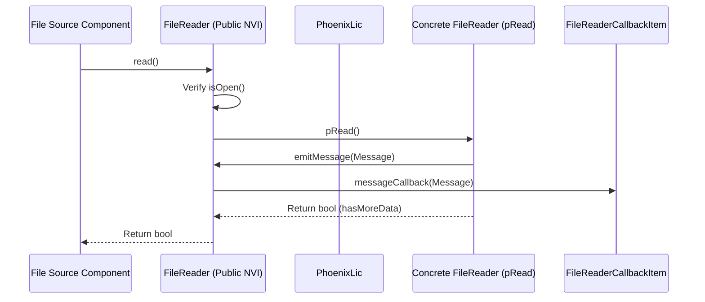

# PhoenixCore File Interface & Plugin SDK

## Overview

The `PhoenixCore/File` module provides standardized abstractions for reading from and writing to telemetry data files. In the Phoenix architecture, a single `FileReader` or `FileWriter` instance manages exactly **one recording session (record)**, which may span multiple physical file parts, channels, or event segments.

The file subsystem consists of the following key interfaces and classes:

- **[`FileReader`](#filereader-interface)**: Abstract file reader interface providing streaming playback, random seeking, stream schema discovery, and event inspection.
- **[`FileWriter`](#filewriter-interface)**: Abstract file writer interface handling recording creation, message serialization, byte accounting, and event persistence.
- **[`FileReaderCallbackItem`](#filereadercallbackitem)**: Callback interface for streaming messages, log entries, and error reports from reader threads.
- **[`fileReaderInfo_t` & `fileWriterInfo_t`](#file-information-structures)**: Metadata structures declaring supported extensions, versioning, attributes schemas, and licensing requirements.
- **[`FileLibrary` & `FileAdapter`](#dynamic-plugin-architecture)**: Dynamic plugin architecture enabling runtime discovery and instantiation of file format DLLs via the exported `GetFiles` symbol.

```mermaid
graph TD
    subgraph "Application Layer"
        FSRC["File Source Component"] -->|Reads via| FR["FileReader (NVI Interface)"]
        FOUT["File Output Component"] -->|Writes via| FW["FileWriter (NVI Interface)"]
    end

    subgraph "File Abstraction & Callbacks"
        FR -->|Dispatches to| FRC["FileReaderCallbackItem"]
        FRC -->|messageCallback(msg)| FSRC
        FOUT -->|write(msg)| FW
    end

    subgraph "Dynamic Library / Factory"
        FLM["FileLibraryManager"] -->|Loads DLL (GetFiles)| FL["FileLibrary"]
        FL --> FA["FileAdapter"]
        FA -->|createReader()| FR
        FA -->|createWriter()| FW
    end

    subgraph "File Format Implementations"
        RWX["RWX Plugin"] -.->|Implements| FA
        DATX["DATX Plugin"] -.->|Implements| FA
        CSV["CSV / HDF5 Plugin"] -.->|Implements| FA
    end
```

---

## Non-Virtual Interface (NVI) Architecture

The file interfaces implement the **Public Non-Virtual Interface (NVI)** pattern:
- **Public methods** (`open()`, `create()`, `read()`, `write()`, `seek()`, `close()`) handle license checkouts (`PhoenixLic`), state validation (`isOpen()`), error trapping, and byte/time tracking.
- **Protected virtual methods** (`pOpen()`, `pCreate()`, `pRead()`, `pWrite()`, `pSeek()`, `pClose()`) are implemented by format plugins.



---

## FileReader Interface

```cpp
#include <PhoenixCore/PhoenixCoreAPI.h>
#include <PhoenixCore/DataTypes/RecordInfo.hpp>
#include <PhoenixCore/DataTypes/EventInfo.hpp>
#include <PhoenixCore/DataTypes/Message.hpp>
#include <PhoenixCore/File/FileInfo.hpp>

class FileReaderCallbackItem;

class FileReader
{
public:
    FileReader();
    virtual ~FileReader();

    // Public NVI Methods
    RecordInfo_t open(const std::string& uri, const JSON& attributes = {});
    void close();
    std::vector<GraphJson::StreamJson> getStreams();
    uint64_t getFirstTime(); // Nanoseconds since Unix epoch UTC
    uint64_t getLastTime();  // Nanoseconds since Unix epoch UTC
    bool read();             // Advances one step; emits Message to callback. Returns false on EOF.
    bool seek(uint64_t ts);  // Seeks to nearest timestamp
    bool rewind();           // Rewinds to file beginning
    eventInfo_t getEventInfo();
    void setCallback(std::shared_ptr<FileReaderCallbackItem> cb);
    fileReaderInfo_t getFileReaderInfo() const;
    boost::uuids::uuid getUUID() const;
    bool isOpen() const;

protected:
    // Protected Virtual Hooks (p*)
    virtual RecordInfo_t pOpen(const std::string& uri, const JSON& attributes) = 0;
    virtual void pClose() = 0;
    virtual std::vector<GraphJson::StreamJson> pGetStreams() = 0;
    virtual uint64_t pGetFirstTime() = 0;
    virtual uint64_t pGetLastTime() = 0;
    virtual bool pRead() = 0;
    virtual bool pSeek(uint64_t ts) = 0;
    virtual bool pRewind() = 0;
    virtual eventInfo_t pGetEventInfo() = 0;
    virtual fileReaderInfo_t pGetFileReaderInfo() const = 0;

    // Helper Dispatchers for Drivers
    void emitMessage(const Message& msg) const;
    void emitLog(const std::string& logmsg, uint64_t timestamp = 0) const;
    void emitError(uint64_t timestamp, EventManager::event_lvls_t lvl, const std::string& errMsg) const;
};
```

---

## FileWriter Interface

```cpp
#include <PhoenixCore/PhoenixCoreAPI.h>
#include <PhoenixCore/DataTypes/RecordInfo.hpp>
#include <PhoenixCore/DataTypes/EventInfo.hpp>
#include <PhoenixCore/DataTypes/Message.hpp>
#include <PhoenixCore/File/FileInfo.hpp>

class FileWriter
{
public:
    FileWriter();
    virtual ~FileWriter();

    // Public NVI Methods
    void create(const std::string& uri, const RecordInfo_t& recordInfo, 
                const GraphJson::StreamJson& streams, const JSON& attributes = {});
    void write(const Message& msg);
    void close();
    uint64_t getBytesWritten() const;
    fileWriterInfo_t getFileWriterInfo() const;
    void setEventInformation(const eventInfo_t& eventInfo);
    eventInfo_t getEventInformation() const;
    bool isOpen() const;
    boost::uuids::uuid getUUID() const;

protected:
    // Protected Virtual Hooks (p*)
    virtual void pCreate(const std::string& uri, const RecordInfo_t& recordInfo, 
                         const GraphJson::StreamJson& streams, const JSON& attributes) = 0;
    virtual void pClose() = 0;
    virtual bool pWrite(const Message& msg) = 0;
    virtual void pSetEventInformation(const eventInfo_t& eventInfo) = 0;
    virtual fileWriterInfo_t pGetFileWriterInfo() const = 0;
    virtual eventInfo_t pGetEventInformation() const = 0;
};
```

---

## File Information Structures

Drivers describe their supported file formats using `fileReaderInfo_t` and `fileWriterInfo_t`:

```cpp
struct fileReaderInfo_t {
    std::string name;                          // Format name (e.g., "CSV File Reader")
    boost::uuids::uuid uuid;                   // Format UUID
    std::vector<std::string> supportedExtensions;// e.g., [".csv", ".txt"]
    std::string description;
    std::string feature;                       // Apex license feature (e.g., "custom-reader")
    phoenixVersion_t version;
    std::string attributesFile;                // Schema JSON path
};

struct fileWriterInfo_t {
    std::string name;                          // Format name (e.g., "CSV File Writer")
    boost::uuids::uuid uuid;
    std::vector<std::string> supportedExtensions;
    std::string description;
    std::string feature;                       // Apex license feature (e.g., "custom-writer")
    phoenixVersion_t version;
    std::string attributesFile;
};
```

---

## Step-by-Step Plugin Implementation Guide

### Step 1: Implement the Concrete Reader & Writer

```cpp
#include <PhoenixCore/File/FileReader.hpp>
#include <PhoenixCore/File/FileWriter.hpp>
#include <PhoenixCore/File/FileLibrary.hpp>
#include <boost/uuid/string_generator.hpp>
#include <fstream>

static const std::string CSV_READER_UUID = "6c123456-789a-bcde-f012-3456789abcde";
static const std::string CSV_WRITER_UUID = "6c123456-789a-bcde-f012-3456789abcdf";

class CustomCSVReader : public FileReader
{
private:
    std::ifstream m_file;
    uint64_t m_firstTime = 0;
    uint64_t m_lastTime = 0;

protected:
    RecordInfo_t pOpen(const std::string& uri, const JSON& attributes) override {
        m_file.open(uri);
        if (!m_file.is_open()) {
            throw std::runtime_error("Failed to open CSV file: " + uri);
        }
        RecordInfo_t rec;
        rec.record_id = 1;
        rec.record_start = 1700000000000000000ULL;
        return rec;
    }

    void pClose() override {
        if (m_file.is_open()) m_file.close();
    }

    std::vector<GraphJson::StreamJson> pGetStreams() override {
        std::vector<GraphJson::StreamJson> streams;
        GraphJson::StreamJson s;
        s.name() = "CSV/Data";
        s.logicalName() = "Channel 1";
        s.mtype() = "vector";
        s.dtype() = "number_32";
        s.delta() = 0.001; // 1 kHz
        streams.push_back(s);
        return streams;
    }

    uint64_t pGetFirstTime() override { return m_firstTime; }
    uint64_t pGetLastTime() override { return m_lastTime; }

    bool pRead() override {
        std::string line;
        if (std::getline(m_file, line)) {
            Message msg;
            msg.setDataType(Message::DATA_FLOATS);
            msg.setMessageType(Message::MSG_VECTOR_DATA);
            // Parse line into floats...
            emitMessage(msg);
            return true;
        }
        return false; // EOF
    }

    bool pSeek(uint64_t ts) override { return true; }
    bool pRewind() override {
        m_file.clear();
        m_file.seekg(0);
        return true;
    }

    eventInfo_t pGetEventInfo() override { return eventInfo_t{}; }

    fileReaderInfo_t pGetFileReaderInfo() const override {
        fileReaderInfo_t info;
        info.name = "Custom CSV Reader";
        info.uuid = boost::uuids::string_generator()(CSV_READER_UUID);
        info.supportedExtensions = {".csv", ".txt"};
        info.feature = "custom-reader";
        return info;
    }
};
```

---

### Step 2: Implement File Adapter & Export DLL Symbol

```cpp
class CustomCSVAdapter : public FileAdapter
{
public:
    std::shared_ptr<FileReader> createReader() override {
        return std::make_shared<CustomCSVReader>();
    }
    std::shared_ptr<FileWriter> createWriter() override {
        return nullptr; // Or return CustomCSVWriter instance
    }
    std::string getReaderName() const override { return "Custom CSV Reader"; }
    std::string getReaderUUID() const override { return CSV_READER_UUID; }
    fileReaderInfo_t getReaderInfo() const override {
        return CustomCSVReader().getFileReaderInfo();
    }
};

extern "C" PHOENIXCORE_API_SYMBOL FileLibrary* GetFiles() {
    static FileLibrary* s_lib = nullptr;
    if (!s_lib) {
        std::vector<std::shared_ptr<FileAdapter>> adapters;
        adapters.push_back(std::make_shared<CustomCSVAdapter>());
        s_lib = new FileLibrary("CustomCSVFileLibrary", adapters);
    }
    return s_lib;
}
```

---

## Python Usage (`PhoenixPy`)

```python
from phoenixpy import file, phoenixLic

def read_custom_telemetry_file():
    # 1. Initialize license
    lic = phoenixLic.PhoenixLic.instance()
    lic.setAppInfo("PyFileApp", "PyFileApp", "2026.1", "localhost", "127.0.0.1", 0)
    lic.connect()

    # 2. Discover file plugins
    file_mgr = file.getFileLibraryManager()
    file_mgr.loadLibraries("plugins/file")

    # 3. Create reader by extension
    adapters = file_mgr.getAdapters()
    csv_reader = adapters[0].createReader()

    # 4. Open and stream messages
    rec_info = csv_reader.open("C:/data/flight_test_01.csv")
    print(f"File Opened: Start Time = {rec_info.record_start}")

    streams = csv_reader.getStreams()
    print(f"Discovered {len(streams)} channels.")

    # Read records step-by-step
    while csv_reader.read():
        pass # Messages dispatched to attached callback

    csv_reader.close()

if __name__ == "__main__":
    read_custom_telemetry_file()
```

---

## Implementation Checklist for File Plugin Developers

- [ ] Subclass `FileReader` or `FileWriter`.
- [ ] Implement all protected virtual `p*` methods (`pOpen`, `pClose`, `pRead`, `pWrite`, `pSeek`, `pRewind`).
- [ ] Define `fileReaderInfo_t` / `fileWriterInfo_t` with supported extensions and feature name.
- [ ] Implement `FileAdapter` and export `GetFiles`.
