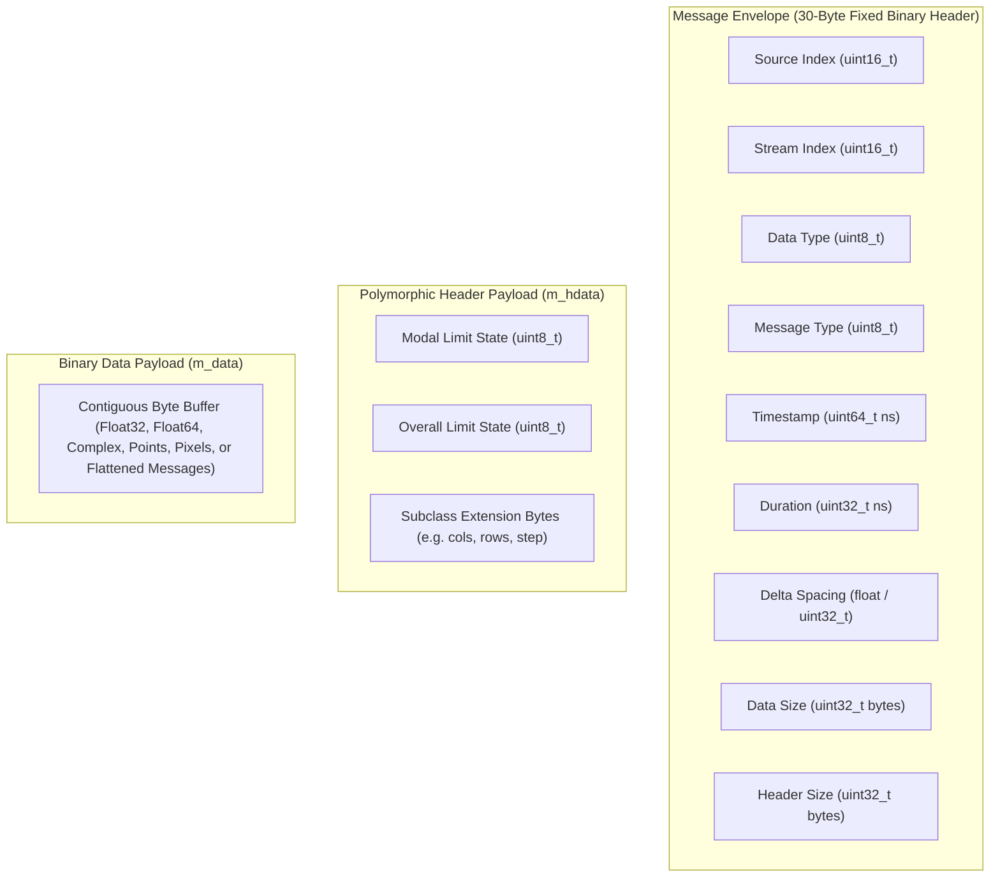
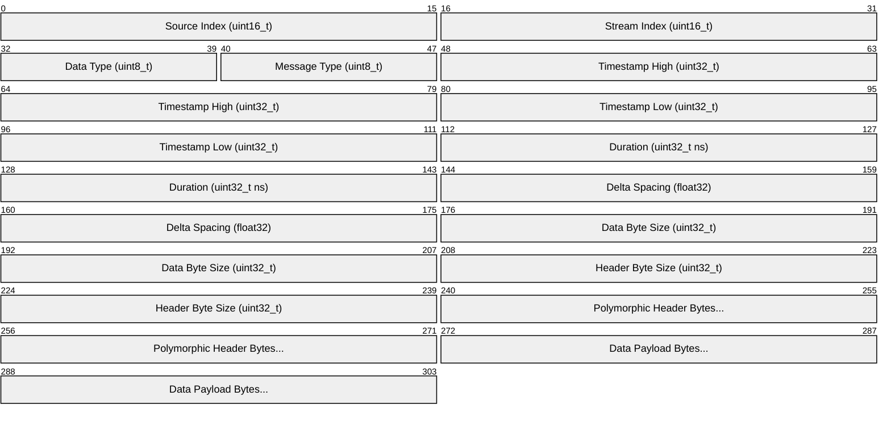
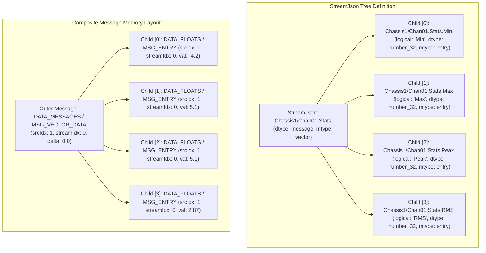

# PhoenixCore Message Architecture & Data Types

## Overview

The `Message` class (`PhoenixCore/DataTypes/Message.hpp`) is the universal, zero-copy binary data envelope used across the entire Phoenix ecosystem. It encapsulates raw telemetry streams, matrix/tensor buffers, video frames, JSON payloads, digital twin solution fields, and **composite/hierarchical message trees** as they travel between components, network sockets (ZeroMQ), and storage systems (files and databases).

Key architectural capabilities:
- **Zero-Copy Memory Model**: Data and header payloads are managed via reference-counted smart buffers (`std::shared_ptr<std::string>`), enabling fast pipeline dispatch across multiple subscriber nodes.
- **Fixed & Extensible Headers**: 30-byte fixed metadata packet + polymorphic header extensions (`MessageHeader`, `frameMessageHdr_t`, etc.).
- **Limit & Health Tracking**: Built-in modal and overall limit evaluation states (`GOOD`, `WARN`, `ALERT`).
- **High-Precision Timing**: 64-bit nanosecond timestamps since Unix epoch UTC with duration and sample delta spacing.
- **High-Performance Serialization**: Compact binary serialization for ZeroMQ network transport and binary file storage.
- **Composite / Hierarchical Messaging**: Bundles multiple sub-messages into a single parent message (`DATA_MESSAGES`), preventing subscription handler queue overflow and reducing network/storage fragmentation for multi-statistic branches.



---

## Message Memory Layout & Binary Structure

When serialized or stored in memory, a `Message` comprises three distinct segments:



### Fixed Header Fields (30 Bytes)

| Field | Type | Offset | Description |
|---|---|---|---|
| `m_srcidx` | `uint16_t` | 0 | Originating source index in the pipeline graph. |
| `m_streamidx` | `uint16_t` | 2 | Originating stream/channel index on the source. |
| `m_datatype` | `uint8_t` | 4 | Numeric/data encoding (see [`data_types_t`](#data-types-enum)). |
| `m_msgtype` | `uint8_t` | 5 | Structural shape (see [`msg_types_t`](#message-types-enum)). |
| `m_tstamp` | `uint64_t` | 6 | Timestamp in nanoseconds since Unix epoch UTC. |
| `m_tdur` | `uint32_t` | 14 | Duration of message block in nanoseconds. |
| `m_delta` | `uint32_t` | 18 | Packed `float32` sample interval (seconds for time, Hz for FFT, `0.0` for composite). |
| `m_sz` | `uint32_t` | 22 | Byte length of the data payload buffer. |
| `m_hsz` | `uint32_t` | 26 | Byte length of the polymorphic header buffer. |

---

## Enumerations & Types

### Data Types Enum (`Message::data_types_t`)

| Enum Value | Hex | Description | Typical C++ Type |
|---|---|---|---|
| `DATA_BYTES` | `0x00` | 1-byte integer / raw bytes | `uint8_t`, `char` |
| `DATA_WORDS` | `0x01` | 2-byte integer | `int16_t`, `uint16_t` |
| `DATA_DWORDS` | `0x02` | 4-byte integer | `int32_t`, `uint32_t` |
| `DATA_QWORDS` | `0x03` | 8-byte integer | `int64_t`, `uint64_t` |
| `DATA_FLOATS` | `0x04` | 4-byte single-precision float | `float` |
| `DATA_DOUBLES` | `0x05` | 8-byte double-precision float | `double` |
| `DATA_CFLOATS` | `0x06` | Complex float pair (Real, Imag) | `std::complex<float>` |
| `DATA_CDOUBLES` | `0x07` | Complex double pair (Real, Imag) | `std::complex<double>` |
| `DATA_MESSAGES` | `0x08` | Embedded flattened child messages (Composite Tree) | `std::vector<Message>` |
| `DATA_STRUCTS` | `0x09` | User-defined binary structure | Custom struct |
| `DATA_STRING` | `0x0A` | Text string | `std::string` |
| `DATA_SOLUTION_FITS` | `0x0B` | Digital twin modal fit data | `SolutionFitData` |
| `DATA_BOOLEAN` | `0x0C` | Boolean flags | `bool` |
| `DATA_CUSTOM_TYPE_BEGIN` | `0xA0` | Start of custom user types | User defined |
| `DATA_CUSTOM_TYPE_END` | `0xFE` | End of custom user types | User defined |
| `DATA_TYPE_INVALID` | `0xFF` | Uninitialized / Invalid | None |

### Message Types Enum (`Message::msg_types_t`)

| Enum Value | Hex | Description |
|---|---|---|
| `MSG_ERR` | `0x00` | Error report / diagnostic message. |
| `MSG_SYSTEM` | `0x01` | System control message / broadcast. |
| `MSG_ENTRY` | `0x02` | Single scalar / point measurement (or single child message). |
| `MSG_JSON` | `0x03` | JSON formatted string payload. |
| `MSG_BSON` | `0x04` | Binary JSON (BSON) payload. |
| `MSG_VECTOR_DATA` | `0x05` | 1-Dimensional contiguous array (or array of child messages). |
| `MSG_MATRIX_DATA` | `0x06` | 2-Dimensional matrix (header defines rows/cols). |
| `MSG_TENSOR_DATA` | `0x07` | N-Dimensional tensor. |
| `MSG_POINT_DATA_2D` | `0x08` | Array of 2D coordinates `Point2D<T>`. |
| `MSG_POINT_DATA_3D` | `0x09` | Array of 3D coordinates `Point3D<T>`. |
| `MSG_VIDEO_FRAME` | `0x0A` | Video image frame (uses `frameMessageHdr_t`). |

### Limit States (`LimitState`)

- **`LimitState::GOOD` (`0x00`)**: Measurement within nominal operating thresholds.
- **`LimitState::WARN` (`0x01`)**: Measurement exceeds warning threshold.
- **`LimitState::ALERT` (`0x02`)**: Measurement exceeds critical alert threshold.

---

## Composite & Hierarchical Messages (`DATA_MESSAGES`)

When components branch out an input stream into multiple computed metrics (e.g. the **Statistics Processor** calculating min, max, peak, p2p, rms, mean, and crest factor for every input channel), emitting individual messages for every metric across high channel counts causes severe queue contention, network framing overhead, and buffer overruns in `ComponentSubscriptionHandler`.

To eliminate this bottleneck, PhoenixCore supports **Composite Messages** using `DATA_MESSAGES`.



### Composite Message Rules & Specifications

1. **Top-Level Container Message**:
   - `datatype`: `Message::DATA_MESSAGES` (`0x08`)
   - `msgtype`: `Message::MSG_VECTOR_DATA` (`0x05`) for multiple child messages, or `Message::MSG_ENTRY` (`0x02`) for a single wrapped message.
   - `srcIdx` & `streamIdx`: Assigned to the top-level stream channel.
   - `tstamp` & `tdur`: Set to the block/interval timestamp and duration.
   - `delta`: `0.0`.
   - `m_data`: Contains the contiguous flattened binary bytes of all child messages via `setMessageVector()`.
   - `MessageHeader`: Holds the aggregated limit state (e.g. `ALERT` if any child is in `ALERT`).

2. **Child Messages**:
   - `srcIdx` & `streamIdx`: **Must match the parent container's `srcIdx` and `streamIdx`** (preserving single-channel routing through the pipeline engine).
   - Each child maintains its own `datatype` (e.g. `DATA_FLOATS`), `msgtype` (`MSG_ENTRY` or `MSG_VECTOR_DATA`), `tstamp`, `tdur`, `delta`, payload buffer, and `MessageHeader` (with individual `LimitState`).
   - **Strict Positional Ordering**: The order of child messages in the byte payload must match $1:1$ with the order of child streams defined in the [`StreamJson`](GraphJson.md#hierarchical--composite-streams) definition.

3. **Stream Naming Scheme**:
   - **Top-Level Stream Name**: Follows the standard path format: `<OriginSourceComponent>/<StreamName>` (e.g. `Chassis1/Chan01` or `StatsProcessor/Chan01_Stats`).
   - **Child Stream Names**: Uses **dot notation** appended to the parent's `name`:
     - 1-level child: `<OriginSourceComponent>/<StreamName>.<stat>` (e.g. `Chassis1/Chan01.Min`, `Chassis1/Chan01.Max`, `Chassis1/Chan01.RMS`).
     - Multi-level child: `<OriginSourceComponent>/<StreamName>.<level1>.<level2>` (e.g. `Chassis1/Chan01.Harmonics.H1`).
   - **Logical Names**: Concise, human-readable name of the specific level/leaf:
     - Top-level: `"Channel 1"` or `"Channel 1 Statistics"`.
     - Child stream: `"Min"`, `"Max"`, `"RMS"`, `"myStat"`.
     - Multi-level child: `"H1"`, `"Harmonic 1"`.

4. **Recursive Multi-Level Trees**:
   - A child message can itself be of type `DATA_MESSAGES`, enabling N-ary tree structures (e.g., Channel $\rightarrow$ Harmonics $\rightarrow$ Harmonic Components).

5. **Consumer Access (Plotting & Storage)**:
   - To plot or store a specific sub-statistic, consumers use $O(1)$ indexing by retrieving the child index from the `StreamJson` tree and unrolling `msg.getMessageVector()[childIndex]`.

---

## Long IDs & Code Identifiers

For rapid lookup in stream routing tables, `Message` provides compound integer identifiers:

- **`getLongId()`**: 32-bit integer combining source index and stream index:
  $$\text{LongID} = (\text{srcIdx} \ll 16) \mid \text{streamIdx}$$
- **`getCode()`**: 64-bit integer combining source index, stream index, data type, and message type:
  $$\text{Code} = (\text{srcIdx} \ll 32) \mid (\text{streamIdx} \ll 16) \mid (\text{dataType} \ll 8) \mid \text{msgType}$$

---

## C++ API Usage & Examples

### 1. Creating and Allocating a Standard Vector Message

```cpp
#include <PhoenixCore/DataTypes/Message.hpp>
#include <chrono>

Message createTelemetryMessage(uint16_t srcIdx, uint16_t streamIdx, const std::vector<float>& samples, float delta)
{
    Message msg;
    msg.setSrcIdx(srcIdx);
    msg.setStreamIdx(streamIdx);
    msg.setDataType(Message::DATA_FLOATS);
    msg.setMessageType(Message::MSG_VECTOR_DATA);
    msg.setDelta(delta);
    
    uint64_t now = std::chrono::duration_cast<std::chrono::nanoseconds>(
        std::chrono::system_clock::now().time_since_epoch()).count();
    msg.setTimeNano(now);
    msg.setDurationNano(static_cast<uint32_t>(samples.size() * delta * 1e9));

    // Allocate payload and copy data
    msg.setSize(static_cast<uint32_t>(samples.size() * sizeof(float)), true);
    float* ptr = msg.getPtr<float>();
    std::memcpy(ptr, samples.data(), samples.size() * sizeof(float));

    // Set Limit State in Header
    auto hdr = std::make_shared<MessageHeader>();
    hdr->setLimitOverall(LimitState::GOOD);
    msg.setHeader(hdr);

    return msg;
}
```

### 2. Creating a Composite Message (`DATA_MESSAGES`)

```cpp
Message createStatisticsCompositeMessage(uint16_t srcIdx, uint16_t streamIdx, uint64_t timestamp,
                                         float minVal, float maxVal, float peakVal, float rmsVal)
{
    std::vector<Message> childMessages;

    auto makeScalarChild = [&](float val, LimitState limit) {
        Message child;
        child.setSrcIdx(srcIdx);       // Must match parent srcIdx
        child.setStreamIdx(streamIdx); // Must match parent streamIdx
        child.setDataType(Message::DATA_FLOATS);
        child.setMessageType(Message::MSG_ENTRY);
        child.setTimeNano(timestamp);
        child.setDelta(0.0f);
        child.setSize(sizeof(float), true);
        *child.getPtr<float>() = val;

        auto hdr = std::make_shared<MessageHeader>();
        hdr->setLimitOverall(limit);
        child.setHeaderData(hdr);
        return child;
    };

    // Strict ordering matching StreamJson definition: [0]=Min, [1]=Max, [2]=Peak, [3]=RMS
    childMessages.push_back(makeScalarChild(minVal, LimitState::GOOD));
    childMessages.push_back(makeScalarChild(maxVal, LimitState::GOOD));
    childMessages.push_back(makeScalarChild(peakVal, LimitState::GOOD));
    childMessages.push_back(makeScalarChild(rmsVal, LimitState::WARN));

    // Outer Container Message
    Message container;
    container.setSrcIdx(srcIdx);
    container.setStreamIdx(streamIdx);
    container.setDataType(Message::DATA_MESSAGES);
    container.setMessageType(Message::MSG_VECTOR_DATA);
    container.setTimeNano(timestamp);
    container.setDelta(0.0f);
    container.setMessageVector(childMessages);

    // Set overall container limit state to worst-case (WARN)
    auto outerHdr = std::make_shared<MessageHeader>();
    outerHdr->setLimitOverall(LimitState::WARN);
    container.setHeaderData(outerHdr);

    return container;
}
```

### 3. Reading and Unrolling Composite Messages

Composite messages store an in-memory `MessageVectorContainer` (`std::vector<Message>`), eliminating payload copies and intermediate serializations during in-process message passing:

```cpp
void processCompositeMessage(const Message& msg, size_t desiredSubStreamIndex)
{
    if (!msg.valid()) return;

    if (msg.getDataType() == Message::DATA_MESSAGES) {
        // Option A: Direct O(1) single child access (0 heap allocations, 0 copies)
        if (desiredSubStreamIndex < msg.getChildMessageCount()) {
            const Message& subMsg = msg.getChildMessage(desiredSubStreamIndex);
            float val = *subMsg.getPtr<float>();
            LimitState limit = subMsg.getHeaderPtr() ? subMsg.getHeaderPtr()->getLimitOverall() : LimitState::GOOD;
            std::cout << "Direct Child [" << desiredSubStreamIndex << "]: Value=" << val 
                      << ", Limit=" << (limit == LimitState::GOOD ? "GOOD" : "WARN/ALERT") << "\n";
        }

        // Option B: Zero-copy reference to all child messages
        const std::vector<Message>& children = msg.getMessageVectorRef();
        for (size_t i = 0; i < children.size(); ++i) {
            const Message& child = children[i];
            float val = *child.getPtr<float>();
            std::cout << "Child [" << i << "]: " << val << "\n";
        }
    }
}
```

---

## Python Usage (`PhoenixPy`)

```python
from phoenixpy import message
import time

def handle_composite_telemetry():
    # 1. Create Child Messages
    min_msg = message.Message()
    min_msg.setSrcIdx(1)
    min_msg.setStreamIdx(0)
    min_msg.setDataType(message.Message.DATA_FLOATS)
    min_msg.setMessageType(message.Message.MSG_ENTRY)
    min_msg.setF32Vector([-2.5])

    max_msg = message.Message()
    max_msg.setSrcIdx(1)
    max_msg.setStreamIdx(0)
    max_msg.setDataType(message.Message.DATA_FLOATS)
    max_msg.setMessageType(message.Message.MSG_ENTRY)
    max_msg.setF32Vector([8.4])

    # 2. Package into Composite Container
    container = message.Message()
    container.setSrcIdx(1)
    container.setStreamIdx(0)
    container.setDataType(message.Message.DATA_MESSAGES)
    container.setMessageType(message.Message.MSG_VECTOR_DATA)
    container.setTimeNano(int(time.time() * 1e9))
    container.setDelta(0.0)
    container.setMessageVector([min_msg, max_msg])

    # 3. Unroll and Read on Consumer Side
    if container.getDataType() == message.Message.DATA_MESSAGES:
        # Direct indexed access
        count = container.getChildMessageCount()
        print(f"Container holds {count} sub-streams:")
        for i in range(count):
            child = container.getChildMessage(i)
            val = child.getF32Vector()[0]
            print(f"  Sub-Stream [{i}]: Val={val}")

if __name__ == "__main__":
    handle_composite_telemetry()
```
