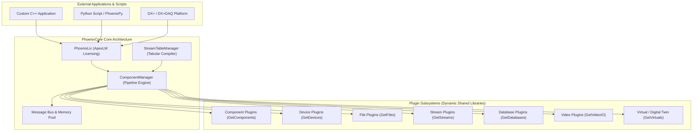

# PhoenixCore Developer Guide & SDK Documentation

## Introduction

**PhoenixCore** is the high-performance, modular C++ core engine and SDK powering Apex Turbine's Phoenix data acquisition, signal processing, and digital twin analytics platform. 

It is designed for real-time telemetry processing, multi-channel hardware acquisition, high-throughput signal analysis (vibration, acoustics, strain, blade tip timing), and digital twin simulation. PhoenixCore exposes both a native C++ SDK and a Python SDK ([`PhoenixPy`](#python-sdk-phoenixpy)).



---

## Table of Contents

| Document | Module / Topic | Description |
|---|---|---|
| **[`Component.md`](Component.md)** | **Pipeline Execution Engine** | `Component` base class, `componentInfo_t`, lifecycle, stream setup/validation, `ComponentManager`, `ComponentSubscriptionHandler`, `ComponentRemoteManager`, and `GetComponents` plugin export. |
| **[`Device.md`](Device.md)** | **Hardware Device Abstractions** | `Device` NVI base class, `deviceInfo_t`, hierarchical hardware trees (`deviceItem_t`), streaming callbacks, output writing, and `GetDevices` plugin export. |
| **[`File.md`](File.md)** | **File I/O & Recording Formats** | `FileReader`, `FileWriter`, `fileReaderInfo_t`, streaming playback, seeking, event persistence, and `GetFiles` plugin export. |
| **[`Stream.md`](Stream.md)** | **Network Transport & Pub/Sub** | `StreamReceiver`, `StreamTransmitter`, network discovery (mDNS), ZeroMQ/TCP streaming, RPC transactions, and `GetStreams` plugin export. |
| **[`Database.md`](Database.md)** | **Telemetry & Event Databases** | `PhoenixDBConnection`, `PhoenixDBReader`, `PhoenixDBWriter`, `DBQuery`, schema migrations, health checks, and `GetDatabases` plugin export. |
| **[`Video.md`](Video.md)** | **Video Camera & Frame Processing** | `VideoInput`, frame headers (`frameMessageHdr_t`), camera properties, frame callbacks, and `GetVideoIO` plugin export. |
| **[`Virtual.md`](Virtual.md)** | **Digital Twin & Virtual Sensing** | `VirtualModel` (`vtkMultiBlockDataSet`), `VirtualSensor`, `VirtualSensorManager`, `VirtualController`, FEA modal superposition (`SolutionFilter`), and `GetVirtuals` plugin export. |
| **[`Message.md`](Message.md)** | **Binary Message Envelope** | `Message` memory layout, 30-byte header, polymorphic headers, data types (`data_types_t`), message types (`msg_types_t`), and limit states. |
| **[`GraphJson.md`](GraphJson.md)** | **Component-Centric Pipeline Graph** | Directed Acyclic Graph (DAG) JSON schema, `SourceJson`, `StreamJson`, conditions, automations, and stream routing. |
| **[`TableJson.md`](TableJson.md)** | **Stream-Centric Tabular Format** | Stream-centric spreadsheet setup format vs. DAG graph, and automatic compilation via `StreamTableManager`. |
| **[`PhoenixJson.md`](PhoenixJson.md)** | **JSON Helper Utilities** | Exception-safe, typed JSON extraction helpers with fallback defaults (`getString`, `getDouble`, `getInt`, etc.). |
| **[`PhoenixLic.md`](PhoenixLic.md)** | **Licensing Client & Features** | `PhoenixLic` singleton initialization, `ApexLM` client, token checkouts (`ANALYSIS`, `APEXDS_CHANNELS_`), and heartbeat monitoring. |
| **[`Utilities.md`](Utilities.md)** | **Common Utilities** | `EventManager`, `ZMQClient`, `ZMQServer`, `PhoenixThreadPool`, `PhoenixUUID`, and `NamingConventionHelpers`. |

---

## Dynamic Plugin System & DLL Symbols

PhoenixCore dynamically discovers and loads third-party plugins from `.dll` (Windows) or `.so` (Linux) shared libraries. Each plugin module exports a standard C factory symbol:

| Module | Exported Symbol | Return Type | Purpose |
|---|---|---|---|
| **Component** | `GetComponents` | `ComponentLibrary*` | Exports custom analytical processors, math nodes, and pipeline filters. |
| **Device** | `GetDevices` | `DeviceLibrary*` | Exports hardware acquisition drivers (Scanivalve, MeCalc, NI DAQ, etc.). |
| **File** | `GetFiles` | `FileLibrary*` | Exports file format readers and writers (RWX, DATX, CSV, HDF5). |
| **Stream** | `GetStreams` | `StreamLibrary*` | Exports network streaming transports (ZeroMQ, WebSocket, MQTT). |
| **Database** | `GetDatabases` | `DatabaseLibrary*` | Exports telemetry database connectors (SQLite, PostgreSQL, Timescale). |
| **Video** | `GetVideoIO` | `VideoLibrary*` | Exports camera drivers and video file readers. |
| **Virtual** | `GetVirtuals` | `VirtualLibrary*` | Exports 3D FEA model loaders and virtual sensor physics. |

---

## C++ SDK Quickstart

Below is a complete standalone C++ example demonstrating licensing initialization, plugin loading, graph configuration, and pipeline execution:

```cpp
#include <PhoenixCore/PhoenixLic/PhoenixLic.hpp>
#include <PhoenixCore/Component/ComponentManager.hpp>
#include <PhoenixCore/Component/ComponentLibrary.hpp>
#include <PhoenixCore/DataTypes/GraphJson.hpp>
#include <iostream>

int main()
{
    // 1. Mandatory Licensing Initialization
    auto lic = PhoenixLic::instance();
    lic->setAppInfo("app_uuid_001", "QuickstartApp", "2026.1", "localhost", "127.0.0.1", 0);
    std::string licErr;
    if (!lic->connect(licErr)) {
        std::cerr << "License connection failed: " << licErr << "\n";
        return 1;
    }

    // 2. Discover and Load Dynamic Plugins
    auto compLibMgr = getComponentLibraryManager();
    compLibMgr->loadLibraries("bin/components");

    // 3. Create ComponentManager Pipeline Engine
    ComponentManager manager("MainPipeline", true, 4);

    // 4. Load Pipeline Configuration (GraphJson)
    GraphJson graph;
    graph.loadFromFile("config/test_pipeline.json");
    manager.setGraph(graph);

    // 5. Start Real-Time Execution
    manager.start();
    std::cout << "Pipeline running. Press Enter to stop...\n";
    std::cin.get();

    // 6. Stop and Clean Up
    manager.stop();
    lic->disconnect();
    return 0;
}
```

---

## Python SDK (`PhoenixPy`)

Phoenix provides comprehensive Python bindings generated via SWIG.

```python
from phoenixpy import phoenixLic, component, graphJson
import time

def main():
    # 1. Initialize License
    lic = phoenixLic.PhoenixLic.instance()
    lic.setAppInfo("py_app_uuid", "PyQuickstart", "2026.1", "localhost", "127.0.0.1", 0)
    err = lic.connect()
    if err:
        print(f"Licensing failed: {err}")
        return

    try:
        # 2. Instantiate Manager
        mgr = component.ComponentManager("PyEngine", True, 4)
        
        # 3. Load Graph Configuration
        graph = graphJson.GraphJson()
        graph.loadFromFile("config/test_pipeline.json")
        mgr.setGraph(graph)

        # 4. Run Pipeline
        mgr.start()
        print("Pipeline running...")
        time.sleep(5.0)
        mgr.stop()
    finally:
        lic.disconnect()

if __name__ == "__main__":
    main()
```
