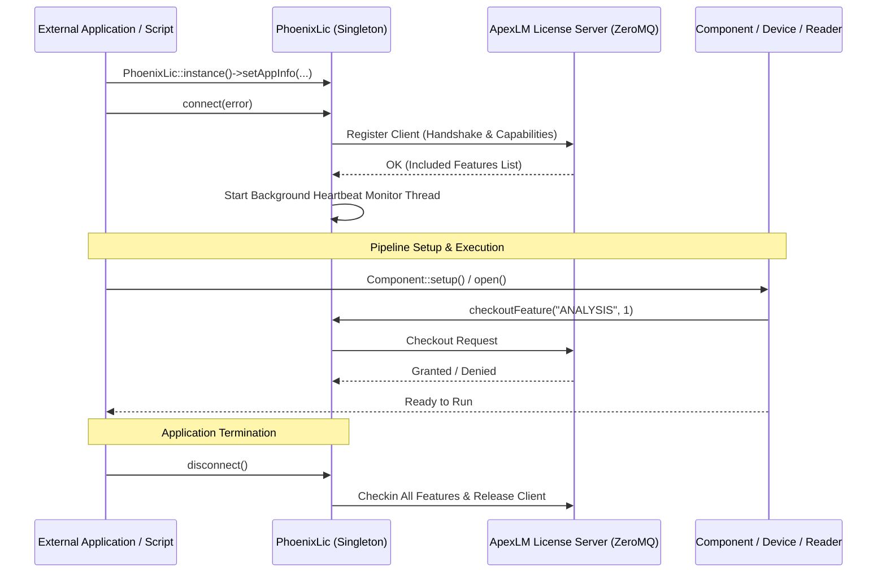

# PhoenixLic & Licensing Architecture

## Overview

The `PhoenixCore/PhoenixLic` module provides the client-side licensing infrastructure for Phoenix. It interfaces with the **Apex License Manager (`ApexLM`)** daemon over ZeroMQ to enforce token-based feature licensing, channel bandwidth limits, and hardware dongle/serial verification.

When using PhoenixCore or `PhoenixPy` in an external application, **initializing the `PhoenixLic` client singleton is a mandatory prerequisite** before instantiating components, opening files, connecting to hardware devices, or executing pipelines.



---

## The Licensing Client Singleton (`PhoenixLic`)

`PhoenixLic` is implemented as a thread-safe singleton accessed via `PhoenixLic::instance()`.

### Key Methods

```cpp
#include <PhoenixCore/PhoenixLic/PhoenixLic.hpp>

class PhoenixLic
{
public:
    static std::shared_ptr<PhoenixLic> instance();

    // Client Registration & Connection
    void setAppInfo(const std::string &uuid, const std::string &appname, const std::string &version,
                    const std::string &hostname, const std::string &hostip, const int pid);
    bool connect(std::string &error);
    bool isConnected() const;
    void disconnect();

    // Feature Token Checkout / Checkin
    bool checkoutFeature(const std::string &uuid, const std::string &featureName, int count, std::string &errMsg);
    bool checkoutFeatures(const std::string &uuid, const std::map<std::string, int> &featureMap, std::string &errMsg);
    bool checkoutHardware(const std::string &vendor, const std::string &serial, std::string &errMsg);
    void checkinFeature(const std::string &uuid, const std::string &featureName, int count);
    void checkinFeatures(const std::string &uuid, const std::map<std::string, int> &featureMap);

    // Token Queries
    int getTotalTokenCount(const std::string& feature) const;
    int getAvailableTokenCount(const std::string& feature) const;
    int getUsedTokenCount(const std::string& feature) const;
    bool getIncludedFeatures(std::set<std::string> &features, std::string &errMsg);

    // Health & Heartbeat
    bool isConnectionHealthy() const;
    bool needsRestart() const;
};
```

---

## Feature Token Types

| Feature Name | Token Description | Checked Out By |
|---|---|---|
| `ANALYSIS` | General analytical processing token. | Processor components (e.g. FFT, Filters, Math). |
| `APEXDS_CHANNELS_<CLASS>` | Channel bandwidth license based on sample rate class. | Hardware acquisition devices and file readers. |
| `custom-processor` | Third-party custom processor plugin token. | Custom `Component` implementations. |
| `custom-device` | Hardware device driver license token. | Custom `Device` implementations. |
| `custom-reader` | File / Database reader driver token. | Custom `FileReader` / `PhoenixDBReader`. |
| `custom-writer` | File / Database writer driver token. | Custom `FileWriter` / `PhoenixDBWriter`. |
| `custom-network` | Network transport streaming token. | Custom `StreamReceiver` / `StreamTransmitter`. |
| `dxnet-control` | Remote pipeline control token. | `ComponentRemoteManager`. |

---

## Mandatory Initialization for External Applications

If you are developing a standalone C++ application or Python script that uses PhoenixCore, you **must** initialize `PhoenixLic` during startup.

### C++ Initialization Pattern

```cpp
#include <PhoenixCore/PhoenixLic/PhoenixLic.hpp>
#include <PhoenixCore/Component/ComponentManager.hpp>
#include <iostream>

int main(int argc, char* argv[])
{
    // 1. Obtain singleton instance
    auto lic = PhoenixLic::instance();

    // 2. Set Application Information
    lic->setAppInfo(
        "app_instance_uuid_12345", // Unique instance ID
        "MyCustomTelemetryApp",     // Application Name
        "2026.1",                  // Version
        "localhost",               // Hostname
        "127.0.0.1",               // Host IP
        0                          // PID
    );

    // 3. Connect to Apex License Manager
    std::string licError;
    if (!lic->connect(licError)) {
        std::cerr << "Fatal: Failed to connect to Apex License Manager: " << licError << "\n";
        return -1;
    }
    std::cout << "License Manager connected successfully.\n";

    // 4. Now safe to create and run ComponentManager pipelines
    {
        ComponentManager manager("MainPipeline", true, 4);
        // ... load graph and execute ...
    }

    // 5. Cleanly disconnect before application exit
    lic->disconnect();
    return 0;
}
```

---

### Python Initialization Pattern (`PhoenixPy`)

```python
from phoenixpy import phoenixLic, component
import sys

def initialize_phoenix():
    # 1. Obtain singleton
    lic = phoenixLic.PhoenixLic.instance()

    # 2. Configure app metadata
    lic.setAppInfo(
        "python_script_uuid",
        "PythonDataProcessor",
        "2026.1",
        "localhost",
        "127.0.0.1",
        0
    )

    # 3. Connect
    err = lic.connect()
    if err:
        print(f"License connection failed: {err}")
        sys.exit(1)

    print("Phoenix licensing initialized successfully.")

    try:
        # Execute Phoenix pipeline operations
        mgr = component.ComponentManager("PyPipeline", True, 4)
        # ...
    finally:
        # Ensure disconnect is called on exit
        lic.disconnect()

if __name__ == "__main__":
    initialize_phoenix()
```

---

## Health Monitoring & Reconnection

`PhoenixLic` spawns an internal background monitoring thread (`ApexLmClient::monitorConnectionHealth`) that verifies socket responsiveness every 5 seconds.

- If connection to the license server drops, `PhoenixLic::isConnectionHealthy()` returns `false` and automatically attempts reconnection with exponential backoff.
- If the server revokes tokens or requires a hard restart, `PhoenixLic::needsRestart()` returns `true`, signaling the pipeline engine to safely stop acquisition.
