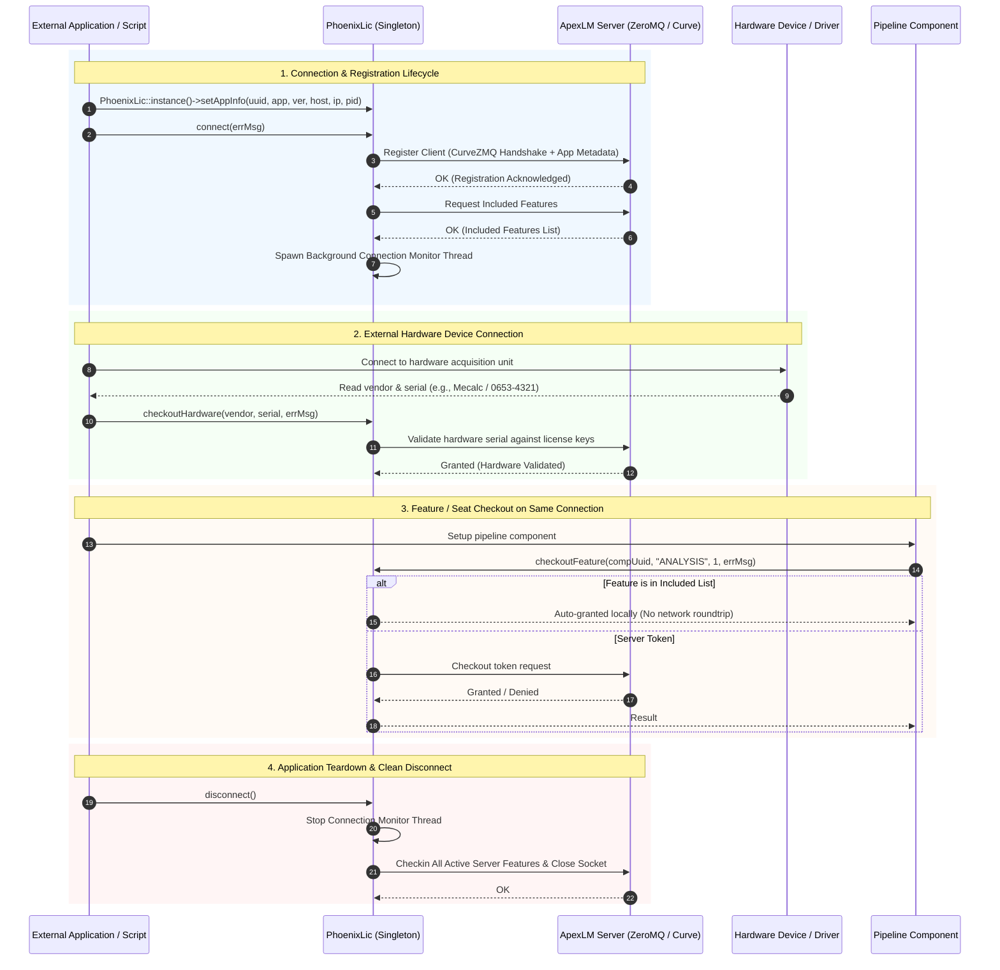

# PhoenixLic & Licensing Architecture

## Overview

The `PhoenixCore/PhoenixLic` module provides the client-side licensing infrastructure for Phoenix. It interfaces with the **Apex License Manager (`ApexLM`)** daemon over ZeroMQ using CurveZMQ encryption to enforce:

- **Token-based functional feature licensing** (e.g. `ANALYSIS`, `spectral_analysis`, `modal_analysis`)
- **Channel bandwidth and sampling rate limits** (`APEXDS_CHANNELS_<CLASS>`)
- **Included features** bundled with application tier configurations (granted locally with zero network round trips)
- **External hardware device validation** (validating hardware vendor and serial numbers against signed licenses upon device connection)
- **Automatic reconnection and seat reconciliation** across transient server restarts

When using PhoenixCore or `PhoenixPy` in an external application or test suite, **initializing the `PhoenixLic` client singleton is a mandatory prerequisite** before instantiating components, opening licensed file readers/writers, connecting to acquisition devices, or running execution graphs.



---

## Unified Client Architecture: Hardware Validation vs. Software Features

Phoenix licensing distinguishes between **software capabilities** and **hardware devices**, allowing both to be queried, checked out, and validated seamlessly across the **same client connection**:

1. **Software Feature Requests (`checkoutFeature` / `checkoutFeatures`)**:
   - Validate and allocate capacity seats or tokens for analytical algorithms (e.g. FFT, modal filtering), channel counts, and plugin types.
   - For applications operating in software-only mode (such as `ApexAnalysis`), software features can be checked out freely without requiring any hardware device serials.
   - If a feature is designated in the server license as **included** with that application tier (e.g., standard math or filters), `PhoenixLic` satisfies the request **locally and immediately** without generating network traffic.

2. **External Hardware Device Validation (`checkoutHardware`)**:
   - Hardware validation is **not** used to unlock or validate the software application itself.
   - Instead, when an application connects to an external physical hardware unit (such as a Mecalc, NI DAQ, or Scanivalve chassis), the driver queries the device's hardware vendor and serial number and passes them to `checkoutHardware(vendor, serial, errMsg)`.
   - The license server validates that the physical device's serial exists within the authorized hardware serial list of the active license.
   - Both hardware device validation and software feature checkouts are performed on the **same `PhoenixLic` connection**.

---

## The Licensing Client Singleton (`PhoenixLic`)

`PhoenixLic` is implemented as a thread-safe singleton accessed via `PhoenixLic::instance()`. It manages internal license seat tracking, local caching, and socket communication via an underlying `ApexLmClient`.

### C++ Interface Definition

```cpp
#include <PhoenixCore/PhoenixLic/PhoenixLic.hpp>

class PhoenixLic
{
public:
    struct LicenseSeats {
        int total = 0;      // Total seats provisioned on server
        int available = 0;  // Remaining unallocated seats on server
        int usedAll = 0;    // Seats currently checked out across all clients
        int usedApp = 0;    // Seats currently checked out by this specific application
    };

    using ConnectionLostCallback = std::function<void(const std::string& reason)>;

    static std::shared_ptr<PhoenixLic> instance();

    // Client Lifecycle & Registration
    void setAppInfo(const std::string &uuid, const std::string &appname, const std::string &version,
                    const std::string &hostname, const std::string &hostip, const int pid);
    bool connect(std::string &error);
    bool isConnected() const;
    void disconnect();
    bool canTerminate();

    // Seat Queries
    bool queryLicenseSeats(const std::string& category, LicenseSeats& seats, std::string& errMsg) const;
    bool getIncludedFeatures(std::set<std::string> &features, std::string &errMsg);
    bool isFeatureIncluded(const std::string &featureName) const;

    // Feature Checkouts & Checkins
    bool checkoutFeature(const std::string &uuid, const std::string &featureName, int count, std::string &errMsg);
    bool checkoutFeature(const std::string &uuid, const std::map<std::string, int> &featureMap, std::string &errMsg);
    bool checkoutFeatures(const std::string &uuid, const std::map<std::string, int> &featureMap, std::string &errMsg);
    void checkinFeature(const std::string &uuid, const std::string &featureName, int count);
    void checkinFeature(const std::string &uuid, const std::map<std::string, int> &featureMap);
    void checkinFeatures(const std::string &uuid, const std::map<std::string, int> &featureMap);

    // External Hardware Device Validation
    bool checkoutHardware(const std::string &vendor, const std::string &serial, std::string &errMsg);

    // Health, Reconnection & Timeouts
    bool isConnectionHealthy() const;
    bool needsRestart() const;
    void setConnectionLostCallback(ConnectionLostCallback cb);
    void setReconnectTimeoutSeconds(int seconds);
    int getReconnectTimeoutSeconds() const;

    // Deprecated Seat Queries (Replaced by queryLicenseSeats)
    [[deprecated]] int tokenCount(int mode, const std::string& feature) const;
    [[deprecated]] int getTotalTokenCount(const std::string& feature) const;
    [[deprecated]] int getAvailableTokenCount(const std::string& feature) const;
    [[deprecated]] int getUsedTokenCount(const std::string& feature) const;
};
```

---

## Token & Feature Taxonomy

| Feature Name | Type | Description | Typically Checked Out By |
|---|---|---|---|
| `ANALYSIS` | Feature Token | General analytical computation capability | Digital signal processing components (FFT, FIR, IIR, Mode Fit) |
| `APEXDS_CHANNELS_<CLASS>` | Capacity Token | Channel bandwidth tier (e.g. standard vs high-speed) | Hardware DAQ drivers and file stream components |
| `spectral_analysis` | Feature Token | Advanced spectral processing | Order tracking and FFT processors |
| `modal_analysis` | Feature Token | Structural dynamics and modal estimation | Mode Fit and Modal Superposition engines |
| `custom-processor` | Feature Token | Third-party custom plugin execution | Custom analytical `Component` implementations |
| `custom-device` | Feature Token | Custom acquisition hardware driver | Custom `Device` implementations |
| `custom-reader` / `custom-writer` | Feature Token | Proprietary file or database telemetry I/O | Custom `FileReader` / `FileWriter` |
| `dxnet-control` | Feature Token | Remote pipeline control | `ComponentRemoteManager` |
| *Hardware Serials* | Device Validation | Physical chassis/hardware serial number | Hardware drivers during physical device connection |

---

## C++ Integration Guide

### 1. Application Startup & Initialization

```cpp
#include <PhoenixCore/PhoenixLic/PhoenixLic.hpp>
#include <iostream>

int main()
{
    auto lic = PhoenixLic::instance();

    // 1. Configure application metadata
    lic->setAppInfo(
        "app_instance_uuid_001",
        "DataAcquisition",
        "2026.12",
        "localhost",
        "127.0.0.1",
        0 // 0 auto-detects current PID
    );

    // 2. Set reconnection resilience (e.g. 45-second reconnection grace period)
    lic->setReconnectTimeoutSeconds(45);
    lic->setConnectionLostCallback([](const std::string &reason) {
        std::cerr << "CRITICAL: Permanent license loss: " << reason << std::endl;
    });

    // 3. Connect to license server
    std::string err;
    if (!lic->connect(err)) {
        std::cerr << "Failed to connect to license server: " << err << std::endl;
        return 1;
    }

    // 4. Query available seats
    PhoenixLic::LicenseSeats seats;
    if (lic->queryLicenseSeats("ANALYSIS", seats, err)) {
        std::cout << "ANALYSIS seats: " << seats.available << " / " << seats.total << " available.\n";
    }

    // 5. Normal operation ...
    // ...

    // 6. Clean teardown on shutdown
    lic->disconnect();
    return 0;
}
```

### 2. Checking Out Features and Validating Hardware

```cpp
// Checkout 4 channels for an acquisition component
std::string licErr;
if (!lic->checkoutFeature("component-guid-123", "channels", 4, licErr)) {
    std::cerr << "Channel license checkout failed: " << licErr << std::endl;
    return false;
}

// Validate external physical acquisition hardware device
if (!lic->checkoutHardware("Mecalc", "0653-4321", licErr)) {
    std::cerr << "Hardware device serial not authorized: " << licErr << std::endl;
    return false;
}

// Later, during component teardown
lic->checkinFeature("component-guid-123", "channels", 4);
```

---

## Python Integration Guide (`phoenixpy`)

In Python, the licensing subsystem is exposed through `phoenixpy.phoenixLic`.

> [!IMPORTANT]
> **Strict Byte String Handling**:
> The Phoenix Python SWIG bindings are built with `-DSWIG_PYTHON_STRICT_BYTE_CHAR`. All C++ string parameters (`std::string`) expect Python `bytes` (e.g. `b"DataAcquisition"` or `"str".encode("utf-8")`) and return `bytes`.

### Basic Python Setup & Lifecycle

```python
import os
import sys
from phoenixpy import phoenixLic

def main():
    # 1. Obtain singleton instance
    lic = phoenixLic.PhoenixLic.instance()

    # 2. Configure app identity (using bytes for strings)
    app_uuid = b"python-analysis-app-001"
    app_name = b"DataAcquisition"
    app_version = b"2026.12"
    lic.setAppInfo(app_uuid, app_name, app_version, b"localhost", b"127.0.0.1", os.getpid())

    # 3. Connect to local/network license manager
    err = lic.connect()
    if err:
        print(f"Connection failed: {err.decode('utf-8')}")
        sys.exit(1)
    
    print("Connected to ApexLM successfully!")

    try:
        # 4. Query seat metrics using native unpacking
        seats, err_msg = lic.queryLicenseSeatsWithErr(b"analysis")
        if not err_msg:
            print(f"Analysis Seats: Total={seats.total}, Available={seats.available}, Used={seats.usedAll}")

        # 5. Check out functional features (batch dictionary support)
        checkout_map = {b"spectral_analysis": 1, b"modal_analysis": 1}
        err_out = []
        # Note: checkoutFeature accepts either a single feature or a dictionary of features
        ok = lic.checkoutFeature(b"comp-001", checkout_map, err_out)
        if not ok:
            print(f"Checkout failed: {err_out[0].decode('utf-8') if err_out else 'Unknown error'}")

        # 6. Validate external hardware device on the SAME connection
        hw_ok = lic.checkoutHardware(b"Mecalc", b"0653-4321", err_out)
        if hw_ok:
            print("External hardware serial validated successfully!")
        else:
            print(f"Hardware validation failed: {err_out[0].decode('utf-8') if err_out else 'Unknown'}")

        # 7. Checkin features
        lic.checkinFeature(b"comp-001", checkout_map)

    finally:
        # 8. Cleanly release remaining licenses and disconnect
        lic.disconnect()
        print("Disconnected cleanly.")

if __name__ == "__main__":
    main()
```

---

## Reconnection, Health Monitoring & Fault Tolerance

`PhoenixLic` implements an autonomous background health monitoring and recovery loop in `ApexLmClient::monitorConnectionHealth`:

1. **Heartbeat Probing**: Every 30 seconds, the monitor thread verifies server liveness via ZeroMQ keepalive frames.
2. **Reconnection Window**: If communication drops, the client enters a configurable reconnection window (default: 30 seconds, adjustable via `setReconnectTimeoutSeconds(seconds)`).
3. **Automatic State Reconciliation (`reconcileCheckouts`)**:
   - When the connection to the server is re-established, the client immediately re-registers its application identity and instance ID.
   - It re-queries the server's included features list.
   - It issues an atomic batch checkout request restoring all active, non-included seat reservations held prior to the interruption.
4. **Irrecoverable Loss**:
   - If the reconnection window expires without recovery, `needsRestart()` transitions to `true` and the registered `ConnectionLostCallback` is triggered, notifying the host application to halt pipeline execution cleanly.
