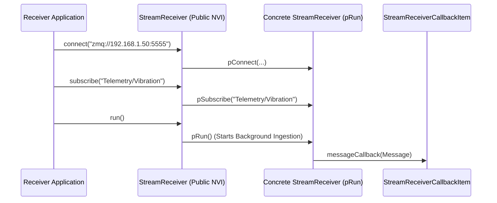

# PhoenixCore Stream Interface & Network Transport SDK

## Overview

The `PhoenixCore/Stream` module provides high-performance, protocol-agnostic abstractions for streaming live telemetry data and commands across networked systems. It establishes standard client (`StreamReceiver`) and server (`StreamTransmitter`) interfaces for pub/sub telemetry distribution, network discovery, and remote request/reply transactions.

The stream subsystem consists of the following primary interfaces and classes:

- **[`StreamReceiver`](#streamreceiver-client-interface)**: Abstract client receiver interface for connecting to remote stream servers, subscribing to topics, discovering available publishers, and receiving live `Message` streams.
- **[`StreamTransmitter`](#streamtransmitter-server-interface)**: Abstract server transmitter interface for binding network endpoints, publishing messages to subscribed topics, handling RPC requests, and broadcasting presence announcements.
- **[`StreamReceiverCallbackItem`](#streamreceivercallbackitem)**: Callback interface for asynchronously processing incoming telemetry messages and status/connection events.
- **[`streamReceiverInfo_t` & `streamTransmitterInfo_t`](#stream-information-structures)**: Metadata structures declaring supported protocols, versioning, attributes schemas, and licensing features.
- **[`StreamLibrary` & `StreamAdapter`](#dynamic-plugin-architecture)**: Dynamic plugin architecture enabling runtime discovery and instantiation of network transport DLLs via the exported `GetStreams` symbol.

```mermaid
graph TD
    subgraph "Publishing Node (Transmitter)"
        SRC["Data Producer / Component"] -->|Pushes Data| ST["StreamTransmitter"]
        ST -->|Publishes on Topic| NET["Network Transport (TCP / ZMQ / WebSocket / UDP)"]
        ST -->|Announces Presence (mDNS)| DISC["Network Discovery Bus"]
    end

    subgraph "Subscribing Node (Receiver)"
        DISC -->|Discovers Servers| SR["StreamReceiver"]
        NET -->|Streams Data| SR
        SR -->|Dispatches via| SRCB["StreamReceiverCallbackItem"]
        SRCB -->|messageCallback(Message)| CONS["Consumer Component / Viewer"]
    end

    subgraph "Dynamic Plugin Architecture"
        SLM["StreamLibraryManager"] -->|Loads DLL (GetStreams)| SL["StreamLibrary"]
        SL --> SA["StreamAdapter"]
        SA -->|createReceiver()| SR
        SA -->|createTransmitter()| ST
    end
```

---

## Non-Virtual Interface (NVI) Architecture

The streaming interfaces follow the **Public Non-Virtual Interface (NVI)** pattern:
- **Public methods** (`connect()`, `disconnect()`, `subscribe()`, `publish()`, `run()`, `stop()`) perform invariant state checks, license checkouts/checkins via `PhoenixLic`, and thread coordination.
- **Protected virtual methods** (`pConnect()`, `pDisconnect()`, `pSubscribe()`, `pPublish()`, `pRun()`, `pStop()`) are overridden by transport protocol implementations.



---

## StreamReceiver Interface

```cpp
#include <PhoenixCore/PhoenixCoreAPI.h>
#include <PhoenixCore/DataTypes/GraphJson.hpp>
#include <PhoenixCore/Utilities/PhoenixJson.hpp>
#include <PhoenixCore/Stream/StreamReceiverCallback.hpp>
#include <PhoenixCore/Stream/StreamInfo.hpp>
#include <boost/uuid/uuid.hpp>

class StreamReceiver
{
public:
    using callback_ptr = std::shared_ptr<StreamReceiverCallbackItem>;

    StreamReceiver();
    virtual ~StreamReceiver();

    // Public NVI Methods
    void connect(const std::string& uri, const JSON& options = JSON::object());
    void disconnect();
    bool isConnected() const;
    std::vector<GraphJson::StreamJson> getStreams();
    std::vector<JSON> discover();
    void subscribe(const std::string& topic);
    void unsubscribe(const std::string& topic);
    void unsubscribeAll();
    std::string request(const JSON& request);
    void setCallback(const callback_ptr& cb);
    void run();
    void stop();
    streamReceiverInfo_t getReceiverInfo() const;
    const boost::uuids::uuid& getUUID() const;

protected:
    // Protected Virtual Hooks (p*)
    virtual void pConnect(const std::string& uri, const JSON& options) = 0;
    virtual void pDisconnect() = 0;
    virtual std::vector<GraphJson::StreamJson> pGetStreams() = 0;
    virtual std::vector<JSON> pDiscover(); // Default discovery implementation
    virtual void pSubscribe(const std::string& topic) = 0;
    virtual void pUnsubscribe(const std::string& topic) = 0;
    virtual void pUnsubscribeAll() = 0;
    virtual std::string pRequest(const JSON& request) = 0;
    virtual void pRun() = 0;
    virtual void pStop() = 0;
    virtual streamReceiverInfo_t pGetReceiverInfo() const = 0;

    const callback_ptr& callback() const;
};
```

---

## StreamTransmitter Interface

```cpp
#include <PhoenixCore/PhoenixCoreAPI.h>
#include <PhoenixCore/DataTypes/GraphJson.hpp>
#include <PhoenixCore/Utilities/PhoenixJson.hpp>
#include <PhoenixCore/Stream/StreamInfo.hpp>
#include <boost/uuid/uuid.hpp>

class StreamTransmitter
{
public:
    using RequestHandler_t = std::function<std::string(const JSON&)>;

    StreamTransmitter();
    virtual ~StreamTransmitter();

    // Public NVI Methods
    void connect(const std::string& uri, const std::vector<GraphJson::StreamJson>& streams, const JSON& options = JSON::object());
    void disconnect();
    bool isConnected() const;
    bool isRunning() const;

    void setRequestHandler(RequestHandler_t handler);
    void run();
    void stop();
    void publish(const std::string& topic, const std::string& payload);
    std::vector<GraphJson::StreamJson> getStreams() const;
    void announce(bool enabled);
    streamTransmitterInfo_t getTransmitterInfo() const;
    const boost::uuids::uuid& getUUID() const;

protected:
    // Protected Virtual Hooks (p*)
    virtual void pConnect(const std::string& uri, const std::vector<GraphJson::StreamJson>& streams, const JSON& options) = 0;
    virtual void pDisconnect() = 0;
    virtual void pRun() = 0;
    virtual void pStop() = 0;
    virtual void pPublish(const std::string& topic, const std::string& payload) = 0;
    virtual std::vector<GraphJson::StreamJson> pGetStreams() const = 0;
    virtual void pAnnounce(bool enabled);
    virtual streamTransmitterInfo_t pGetTransmitterInfo() const = 0;

    const RequestHandler_t& requestHandler() const;
};
```

---

## Stream Information Structures

Transport drivers specify their protocol support using `streamReceiverInfo_t` and `streamTransmitterInfo_t`:

```cpp
struct streamReceiverInfo_t {
    std::string name;                          // Driver name (e.g., "ZeroMQ Receiver")
    boost::uuids::uuid uuid;                   // Driver UUID
    std::vector<std::string> supportedProtocols;// e.g., ["zmq", "tcp", "ws", "mqtt"]
    std::string description;
    std::string feature;                       // Apex license feature (e.g., "custom-network")
    phoenixVersion_t version;
    std::string attributesFile;                // Schema JSON path
};

struct streamTransmitterInfo_t {
    std::string name;                          // Driver name (e.g., "ZeroMQ Transmitter")
    boost::uuids::uuid uuid;
    std::vector<std::string> supportedProtocols;
    std::string description;
    std::string feature;                       // Apex license feature (e.g., "custom-network")
    phoenixVersion_t version;
    std::string attributesFile;
};
```

---

## Step-by-Step Plugin Implementation Guide

### Step 1: Implement the Concrete Stream Receiver & Transmitter

```cpp
#include <PhoenixCore/Stream/StreamReceiver.hpp>
#include <PhoenixCore/Stream/StreamTransmitter.hpp>
#include <PhoenixCore/Stream/StreamLibrary.hpp>
#include <boost/uuid/string_generator.hpp>

static const std::string ZMQ_RECEIVER_UUID = "7d123456-789a-bcde-f012-3456789abcde";
static const std::string ZMQ_TRANSMITTER_UUID = "7d123456-789a-bcde-f012-3456789abcdf";

class CustomZMQReceiver : public StreamReceiver
{
protected:
    void pConnect(const std::string& uri, const JSON& options) override {
        // Connect ZeroMQ SUB socket to uri (e.g., "tcp://127.0.0.1:5555")
    }

    void pDisconnect() override {
        // Close ZeroMQ sockets
    }

    std::vector<GraphJson::StreamJson> pGetStreams() override {
        std::vector<GraphJson::StreamJson> streams;
        // Query transmitter or return configured streams
        return streams;
    }

    void pSubscribe(const std::string& topic) override {
        // Apply ZMQ_SUBSCRIBE filter
    }

    void pUnsubscribe(const std::string& topic) override {
        // Apply ZMQ_UNSUBSCRIBE filter
    }

    void pUnsubscribeAll() override {}

    std::string pRequest(const JSON& request) override {
        // Perform REQ/REP transaction
        return "{\"result\":\"ok\"}";
    }

    void pRun() override {
        // Run receiver background loop; decode incoming binary into Message and call:
        // callback()->messageCallback(msg);
    }

    void pStop() override {
        // Signal background loop to exit
    }

    streamReceiverInfo_t pGetReceiverInfo() const override {
        streamReceiverInfo_t info;
        info.name = "Custom ZeroMQ Receiver";
        info.uuid = boost::uuids::string_generator()(ZMQ_RECEIVER_UUID);
        info.supportedProtocols = {"zmq", "tcp", "ipc"};
        info.feature = "custom-network";
        return info;
    }
};
```

---

### Step 2: Implement Stream Adapter & Export DLL Symbol

```cpp
class CustomZMQAdapter : public StreamAdapter
{
public:
    std::shared_ptr<StreamReceiver> createReceiver() override {
        return std::make_shared<CustomZMQReceiver>();
    }
    std::shared_ptr<StreamTransmitter> createTransmitter() override {
        return nullptr; // Or return CustomZMQTransmitter instance
    }
    std::string getReceiverName() const override { return "Custom ZeroMQ Receiver"; }
    std::string getReceiverUUID() const override { return ZMQ_RECEIVER_UUID; }
    streamReceiverInfo_t getReceiverInfo() const override {
        return CustomZMQReceiver().getReceiverInfo();
    }
};

extern "C" PHOENIXCORE_API_SYMBOL StreamLibrary* GetStreams() {
    static StreamLibrary* s_lib = nullptr;
    if (!s_lib) {
        std::vector<std::shared_ptr<StreamAdapter>> adapters;
        adapters.push_back(std::make_shared<CustomZMQAdapter>());
        s_lib = new StreamLibrary("CustomZMQStreamLibrary", adapters);
    }
    return s_lib;
}
```

---

## Python Usage (`PhoenixPy`)

```python
from phoenixpy import stream, phoenixLic

def run_stream_receiver():
    # 1. Initialize license
    lic = phoenixLic.PhoenixLic.instance()
    lic.setAppInfo("PyStreamApp", "PyStreamApp", "2026.1", "localhost", "127.0.0.1", 0)
    lic.connect()

    # 2. Discover stream transport plugins
    stream_mgr = stream.getStreamLibraryManager()
    stream_mgr.loadLibraries("plugins/stream")

    # 3. Create Receiver
    adapters = stream_mgr.getAdapters()
    receiver = adapters[0].createReceiver()

    # 4. Connect and Subscribe
    receiver.connect("tcp://127.0.0.1:5555")
    receiver.subscribe("Telemetry/Vibration")

    print(f"Connected to stream: {receiver.isConnected()}")
    
    # 5. Start background ingestion
    receiver.run()

if __name__ == "__main__":
    run_stream_receiver()
```

---

## Implementation Checklist for Stream Plugin Developers

- [ ] Subclass `StreamReceiver` or `StreamTransmitter`.
- [ ] Implement protected virtual methods (`pConnect`, `pDisconnect`, `pSubscribe`, `pPublish`, `pRun`, `pStop`).
- [ ] Define `streamReceiverInfo_t` / `streamTransmitterInfo_t` with supported protocols and feature name.
- [ ] Implement `StreamAdapter` and export `GetStreams`.
