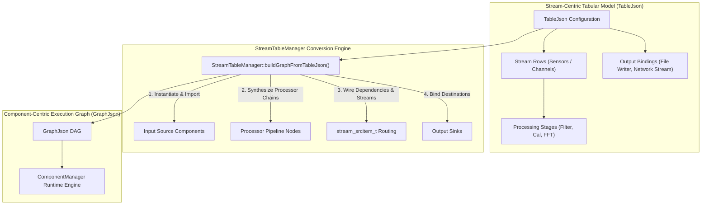
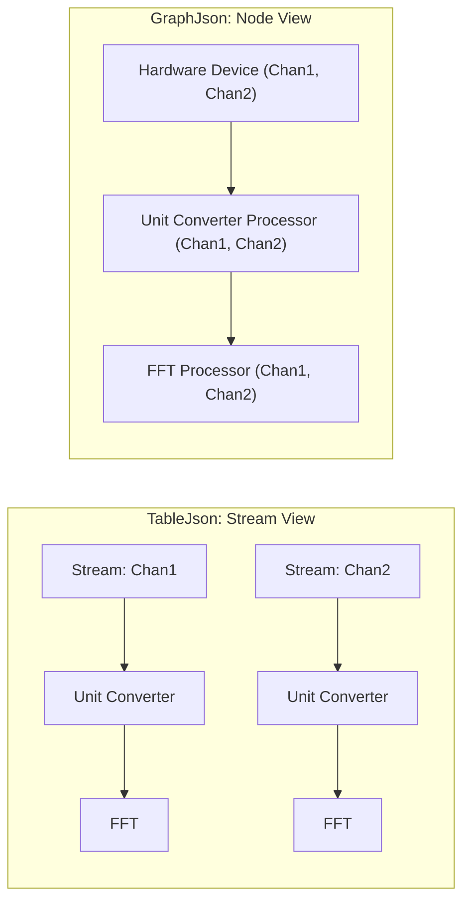
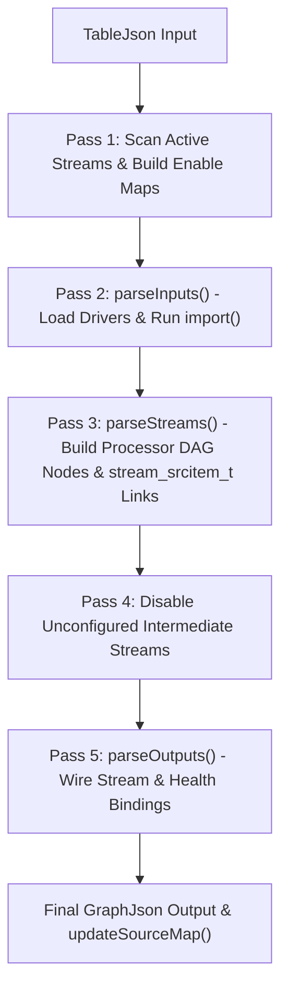

# TableJson & StreamTableManager Architecture

## Overview

In Phoenix, data pipelines can be configured using two complementary paradigms:
1. **Component-Centric DAG ([`GraphJson`](GraphJson.md))**: The native execution graph where the pipeline is organized around computational nodes (`SourceJson`), with each node listing its output streams and upstream dependencies (`stream_srcitem_t`).
2. **Stream-Centric Tabular ([`TableJson`](#tablejson-schema-specification))**: A channel-oriented configuration where the pipeline is organized around measurement channels (rows in a setup table), with inputs, processing stages, and output destinations attached to each channel.

The [`StreamTableManager`](#streamtablemanager-conversion-engine) acts as the compiler that parses `TableJson` configurations and automatically converts them into executable `GraphJson` pipelines.



---

## Comparison: TableJson vs. GraphJson

| Attribute | TableJson (Stream-Centric) | GraphJson (Component-Centric) |
|---|---|---|
| **Primary Organization** | Data channels / streams (spreadsheet rows) | Component instances (`datasources` array) |
| **User Mental Model** | Sensor $\rightarrow$ Stage 1 $\rightarrow$ Stage 2 $\rightarrow$ Output | Directed Acyclic Graph (DAG) of processing blocks |
| **Processor Grouping** | Processors attached per-stream in `processors` map | Processors are standalone sources containing all their streams |
| **Dependency Wiring** | Implicit via processing stage order | Explicit via `stream_srcitem_t` source references |
| **Target Audience** | Test operators, tabular setup GUIs (DX+DAQ) | Core pipeline engine (`ComponentManager`), algorithmic developers |



---

## TableJson Schema Specification

A `TableJson` document consists of four main sections: `inputs`, `processing_stages`, `streams`, and `outputs`.

```json
{
  "name": "Gas Turbine Test Setup",
  "version": "2.0",
  "mode": "TabSetup",
  "date": "2026-08-20",
  "properties": {},
  "metadata": { "author": "Test Engineer", "facility": "Rig 4" },
  "processing_stages": [
    { "name": "unit_convert", "is_enabled": true },
    { "name": "filtering", "is_enabled": true },
    { "name": "spectral_analysis", "is_enabled": true }
  ],
  "inputs": [
    {
      "name": "550e8400-e29b-41d4-a716-446655440001",
      "logicalName": "Chassis 1 DAQ",
      "type": "5b123456-789a-bcde-f012-3456789abcde",
      "channels": ["Chan1", "Chan2"],
      "health": ["Temp_Sensor", "Voltage_Rail"],
      "settings": { "sample_rate": 100000.0 }
    }
  ],
  "streams": [
    {
      "name": "550e8400-e29b-41d4-a716-446655440001/Chan1",
      "logicalName": "Blade 1 Vibration",
      "input": "550e8400-e29b-41d4-a716-446655440001",
      "input_stream": "Chan1",
      "is_enabled": true,
      "processors": {
        "unit_convert": {
          "type": "39d09444-da10-426c-a8d1-40e605008c15",
          "name": "39d09444-da10-426c-a8d1-40e605008c15",
          "logicalName": "EU Scaling",
          "is_enabled": true,
          "settings": { "cs_stream_scalar": 100.0, "cs_stream_offset": 0.0 }
        }
      }
    }
  ],
  "outputs": [
    {
      "name": "660e8400-e29b-41d4-a716-446655440002",
      "logicalName": "Telemetry Streamer",
      "type": "7d123456-789a-bcde-f012-3456789abcdf",
      "settings": { "port": 5555 },
      "streams": [
        {
          "stream": "Blade 1 Vibration",
          "include_raw_input": false,
          "processing_stages": ["unit_convert"]
        }
      ]
    }
  ]
}
```

---

## StreamTableManager Conversion Engine

The `StreamTableManager` performs a multi-pass compilation process to turn `TableJson` into `GraphJson`:



### Key Conversion Steps

1. **Scan & Filter (`inputEnabledStreams`, `processorEnabledStreams`)**: Determines which channels are active so disabled streams can be pruned.
2. **Input Instantiation (`parseInputs`)**: Instantiates each input component using `ComponentLibraryManager`, runs `import(source, emptyParents)` to query all available hardware channels, and sets `isEnabled = true` only for configured channels.
3. **Processor Synthesis (`parseStreams`)**: Groups per-stream processor settings across streams that share the same processor type into unified processor `SourceJson` nodes, wiring the `sources` (`stream_srcitem_t`) dependencies stage-by-stage.
4. **Stream Disabling**: Prunes streams imported by default that were not explicitly configured in the stream table.
5. **Output Wiring (`parseOutputs`)**: Maps bound streams (either raw or from a specific processing stage) to output sinks.

---

## C++ API Usage

```cpp
#include <PhoenixCore/Component/StreamTableManager.hpp>
#include <PhoenixCore/DataTypes/TableJson.hpp>
#include <iostream>

void buildAndRunTabularPipeline(const JSON& tableConfig)
{
    // 1. Instantiate StreamTableManager
    StreamTableManager manager("TabularEngine", true, 4);

    // 2. Parse TableJson directly
    manager.parseStreamJson(tableConfig);

    // 3. Inspect generated GraphJson
    std::shared_ptr<const GraphJson> graph = manager.getGraph();
    std::cout << "Generated Pipeline with " << graph->sources().size() << " component nodes.\n";
    for (const auto& src : graph->sources()) {
        std::cout << "  - Component: " << src.logicalName() 
                  << " (" << src.type() << "), Streams: " << src.streams().size() << "\n";
    }

    // 4. Start execution
    manager.start();
}
```

---

## Python Usage (`PhoenixPy`)

```python
from phoenixpy import streamTableManager, tableJson, phoenixJson, phoenixLic
import json

def compile_table_to_graph():
    # 1. Initialize licensing
    lic = phoenixLic.PhoenixLic.instance()
    lic.setAppInfo("PyTableApp", "PyTableApp", "2026.1", "localhost", "127.0.0.1", 0)
    lic.connect()

    # 2. Load Table JSON from file
    with open("config/turbine_setup.json", "r") as f:
        config_data = json.load(f)

    # 3. Create StreamTableManager
    mgr = streamTableManager.StreamTableManager("PyStreamTableMgr", True, 4)

    # 4. Parse stream-centric configuration
    mgr.parseStreamJson(config_data)

    graph = mgr.getGraph()
    print(f"Compiled Graph: {len(graph.sources())} components registered.")

if __name__ == "__main__":
    compile_table_to_graph()
```
