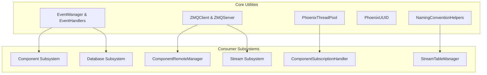
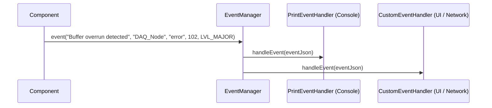
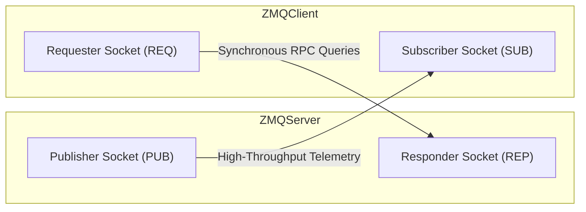

# PhoenixCore Common Utilities & Infrastructure

## Overview

The `PhoenixCore/Utilities` module provides foundational infrastructure services shared across all Phoenix subsystems, including event logging and diagnostics (`EventManager`), high-speed ZeroMQ messaging (`ZMQClient` and `ZMQServer`), multithreaded task scheduling (`PhoenixThreadPool`), UUID generators (`PhoenixUUID`), and stream naming helpers (`NamingConventionHelpers`).



---

## EventManager & Event Handling

The `EventManager` (`PhoenixCore/Utilities/EventManager.hpp`) is the centralized event logging, error reporting, and critical failure monitoring hub for components and managers.

### Event Severity Levels (`EventManager::event_lvls_t`)

| Level | Enum Value | Description |
|---|---|---|
| `LVL_DEBUG` | 0 | Verbose diagnostic printouts and trace data. |
| `LVL_INFO` | 1 | Standard operational logging (component start/stop, config changes). |
| `LVL_WARNING` | 2 | Non-fatal anomaly (e.g. contradictory user settings with fallback). |
| `LVL_MINOR` | 3 | Error that slightly impairs calculation or drops a single sample. |
| `LVL_MAJOR` | 4 | Severe failure impacting pipeline results (e.g. lost sensor stream). |
| `LVL_CRITICAL` | 5 | Unrecoverable system fault; sets `critical() = true` requiring pipeline restart. |



### C++ EventManager Example

```cpp
#include <PhoenixCore/Utilities/EventManager.hpp>
#include <iostream>

class CustomDiagnosticHandler : public EventHandler
{
public:
    void handleEvent(const JSON& eventJson) override {
        std::cout << "[" << eventJson.value("level", "INFO") << "] "
                  << eventJson.value("src", "SYSTEM") << ": "
                  << eventJson.value("msg", "") << "\n";
    }
};

void setupDiagnostics()
{
    auto eventMgr = std::make_shared<EventManager>();
    
    // Add custom handler
    auto handler = std::make_shared<CustomDiagnosticHandler>();
    handler->setMinLevel(EventManager::LVL_INFO);
    eventMgr->addHandler(handler);

    // Emit event
    eventMgr->event("Pipeline initialized successfully", "MainEngine", "log", 0, EventManager::LVL_INFO);
}
```

### Python EventManager Example (`PhoenixPy`)

```python
from phoenixpy import eventManager

class PyLogHandler(eventManager.EventHandler):
    def handleEvent(self, event_json):
        print(f"Python Event Caught: {event_json}")

def test_events():
    mgr = eventManager.EventManager()
    handler = PyLogHandler()
    handler.setMinLevel(eventManager.EventManager.LVL_INFO)
    mgr.addHandler(handler)

    mgr.event("Hello from Python EventManager!", "PyScript", "log", 0, eventManager.EventManager.LVL_INFO)

if __name__ == "__main__":
    test_events()
```

---

## ZMQClient & ZMQServer

The `ZMQClient` and `ZMQServer` classes (`PhoenixCore/Utilities/ZMQ/`) provide thread-safe, high-performance wrappers around ZeroMQ pub/sub and request/reply sockets.



### ZMQServer Usage (C++)

```cpp
#include <PhoenixCore/Utilities/ZMQ/ZmqServer.hpp>

void runTelemetryServer()
{
    ZMQServer server;
    // Bind publisher on port 5555, responder on port 5556
    server.init("*", 5555);

    // Publish telemetry to topic
    server.publish("Turbine/RotorSpeed", "{\"rpm\": 3600.0}");

    // Run RPC responder loop in separate thread
    std::thread rpcThread([&server]() {
        server.run([](const nlohmann::json& request) -> std::string {
            std::string cmd = request.value("cmd", "");
            if (cmd == "ping") return "{\"result\":\"pong\"}";
            return "{\"result\":\"unknown_command\"}";
        });
    });

    rpcThread.detach();
}
```

### ZMQClient Usage (C++)

```cpp
#include <PhoenixCore/Utilities/ZMQ/ZmqClient.hpp>
#include <iostream>

void runTelemetryClient()
{
    ZMQClient client;
    client.init("127.0.0.1", 5555);
    client.subscribe("Turbine/RotorSpeed");

    // 1. Send RPC query
    std::string response = client.send_request({{"cmd", "ping"}});
    std::cout << "RPC Response: " << response << "\n";

    // 2. Start subscriber loop
    client.run([](const std::string& topic, const std::string& payload) {
        std::cout << "Received on [" << topic << "]: " << payload << "\n";
    });
}
```

---

## PhoenixThreadPool

`PhoenixThreadPool` (`PhoenixCore/Utilities/PhoenixThreadPool.hpp`) manages worker threads for asynchronous component task execution:

```cpp
#include <PhoenixCore/Utilities/PhoenixThreadPool.hpp>

void executeConcurrentTasks()
{
    PhoenixThreadPool pool(4); // 4 worker threads

    // Enqueue background work item
    pool.enqueue([]() {
        // Perform compute-heavy task (e.g. FFT block)
    });
}
```

---

## NamingConventionHelpers

`NamingConventionHelpers` (`PhoenixCore/Utilities/NamingConventionHelpers.hpp`) standardizes path-style naming conventions for streams across multi-component pipeline graphs:

- **Format**: `<originSource>/<intermediateProcessor>/.../<streamIdentifier>`
- **`StreamNameBuilder`**: Parses and constructs path-based names:

```cpp
#include <PhoenixCore/Utilities/NamingConventionHelpers.hpp>

void parseStreamNames()
{
    PhoenixNameConventions::StreamNameBuilder builder;
    builder.fromString("Chassis1_DAQ/ScalarProcessor/Channel_01");

    std::string origin = builder.originSource();       // "Chassis1_DAQ"
    std::string leaf = builder.streamNameComponent();  // "Channel_01"
}
```

---

## PhoenixUUID

`PhoenixUUID` (`PhoenixCore/Utilities/PhoenixUUID.hpp`) provides RFC 4122 Version 4 UUID generation and parsing:

```cpp
#include <PhoenixCore/Utilities/PhoenixUUID.hpp>

void generateIds()
{
    std::string newId = PhoenixUUID::generateUUID(); // e.g. "550e8400-e29b-41d4-a716-446655440000"
    bool isValid = PhoenixUUID::isValidUUID(newId);
}
```
