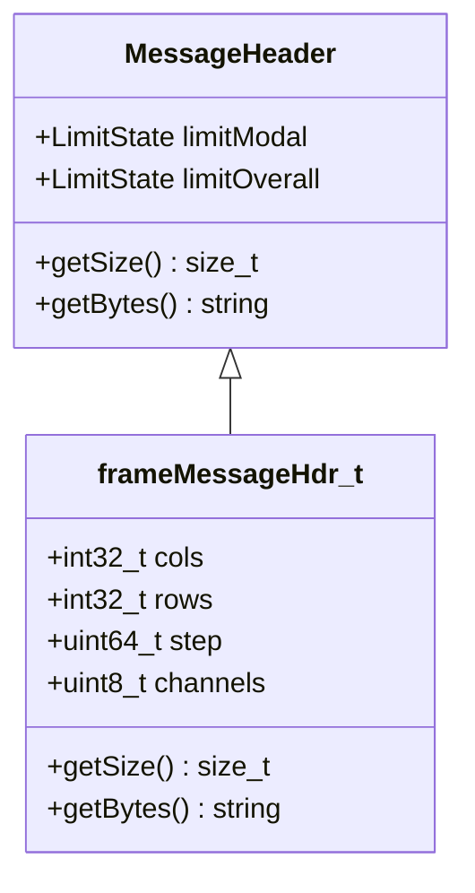

# PhoenixCore Video Interface & Plugin SDK

## Overview

The `PhoenixCore/Video` module provides abstract interfaces and high-speed streaming infrastructure for integrating video cameras, recorded video files, and network video streams into Phoenix telemetry pipelines.

The video subsystem consists of the following key interfaces and classes:

- **[`VideoInput`](#videoinput-interface)**: Abstract base class defining video source lifecycle, frame navigation, properties configuration, background streaming threads, and licensing.
- **[`frameMessageHdr_t`](#video-frame-message-format)**: Specialized message header structure encapsulating frame dimensions (columns, rows), row step size, and color channel count.
- **[`VideoFrameCallback` & `VideoFunctionalFrameCallback`](#video-callbacks)**: Callback interfaces for receiving asynchronously captured video frames as `Message` objects.
- **[`videoInfo_t`](#video-metadata--information-structure)**: Metadata structure declaring video device/reader capabilities, versioning, attributes schemas, and licensing features.
- **[`VideoLibrary` & `VideoAdapter`](#dynamic-plugin-architecture)**: Dynamic plugin architecture enabling runtime discovery and instantiation of video IO DLLs via the exported `GetVideoIO` symbol.

```mermaid
graph TD
    subgraph "Video Sources"
        CAM["Live Camera (camera:///0)"]
        FILE["Video File (file:///path.mp4)"]
        STREAM["RTSP / Web Stream (rtsp://host:554/live)"]
    end

    subgraph "VideoInput Processing Pipeline"
        CAM --> VI["VideoInput"]
        FILE --> VI
        STREAM --> VI
        VI -->|Encodes Frame + Header| HDR["frameMessageHdr_t (cols, rows, step, channels)"]
        HDR --> MSG["Message (MSG_VIDEO_FRAME / DATA_BYTES)"]
    end

    subgraph "Callback & Consumers"
        MSG --> VFC["VideoFrameCallback"]
        VFC --> COMP["Video Processing Component / UI Viewer"]
    end

    subgraph "Dynamic Plugin Architecture"
        VLM["VideoLibraryManager"] -->|Loads DLL (GetVideoIO)| VL["VideoLibrary"]
        VL --> VA["VideoAdapter"]
        VA -->|create()| VI
    end
```

---

## Video Source URI Scheme

The `VideoInput::open(source, syncTime)` method accepts uniform resource identifiers (URIs) across three primary modes:

| Source Type | URI Syntax | Description |
|---|---|---|
| **Local File** | `file:///<path>.<ext>` | Stored video file playback (e.g. `file:///C:/data/flight_cam.mp4`). |
| **Hardware Camera** | `camera:///<index>` | Local USB/PCIe/GigE camera by hardware index (e.g. `camera:///0`). |
| **Network Stream** | `<protocol>://<url>` | Network video stream (e.g. `rtsp://192.168.1.50:554/stream1`, `http://...`). |

---

## Video Frame Message Format

Video frames are transported through the Phoenix pipeline as standard `Message` objects configured with:
- **`Message::msg_types_t`**: `MSG_VIDEO_FRAME` (`0x0A`)
- **`Message::data_types_t`**: `DATA_BYTES` (`0x00`)
- **Payload**: Raw contiguous pixel buffer (8-bit grayscale, 24-bit RGB/BGR, or 32-bit RGBA).
- **Header**: Custom `VideoInput::frameMessageHdr_t` stored within the `MessageHeader`.



### Frame Header Definition

```cpp
struct frameMessageHdr_t : public MessageHeader {
    int32_t cols;        // Frame width in pixels
    int32_t rows;        // Frame height in pixels
    uint64_t step;       // Number of bytes per image row (stride)
    uint8_t channels;    // Number of channels (1=Grayscale, 3=RGB, 4=RGBA)

    frameMessageHdr_t(int32_t cols, int32_t rows, uint64_t step, uint8_t channels)
      : cols(cols), rows(rows), step(step), channels(channels) {}
};
```

---

## VideoInput Interface

```cpp
#include <PhoenixCore/PhoenixCoreAPI.h>
#include <PhoenixCore/DataTypes/Message.hpp>
#include <PhoenixCore/Utilities/PhoenixJson.hpp>
#include <PhoenixCore/Video/VideoInfo.hpp>
#include <PhoenixCore/Video/VideoFrameCallback.hpp>

class VideoInput
{
public:
    VideoInput();
    virtual ~VideoInput();

    virtual const JSON& getInfo() const = 0;
    virtual bool open(const std::string& source, uint64_t syncTime = 0);
    virtual bool close();
    virtual void runThread() = 0; // Background capture thread

    virtual void start();
    virtual void stop();
    virtual void sendFrame(const Message& frame);

    // Frame Navigation (For File Playback)
    virtual size_t getNumberFrames() const;
    virtual size_t getCurrentFrame() const;
    virtual uint64_t getCurrentTime() const; // Nanoseconds from video start
    virtual bool setCurrentFrame(size_t frame);
    virtual bool setCurrentTime(uint64_t time);
    virtual bool nextFrame();
    virtual bool prevFrame();

    // Camera Properties & Control
    virtual JSON getProperty(const std::string& name) const = 0;
    virtual void setProperty(const JSON& props) = 0;
    virtual JSON sendCommand(const JSON& cmd);
    virtual JSON getCommands();

    // Accessors
    bool isOpen() const;
    bool isRunning() const;
    const std::string& getSource() const;
    double getFrameRate() const;
    uint64_t getStartTime() const;
    void setFrameCallback(std::shared_ptr<VideoFrameCallback> callback);
};
```

---

## Step-by-Step Video Plugin Walkthrough

### Step 1: Implement the Concrete VideoInput Class

```cpp
#include <PhoenixCore/Video/VideoInput.hpp>
#include <PhoenixCore/Video/VideoLibrary.hpp>
#include <boost/uuid/string_generator.hpp>

static const std::string MOCK_CAMERA_UUID = "8e123456-789a-bcde-f012-3456789abcde";

class CustomWebcamInput : public VideoInput
{
private:
    JSON m_infoJson;

public:
    CustomWebcamInput() {
        videoInfo_t info;
        info.name = "Custom Webcam Video Driver";
        info.uuid = boost::uuids::string_generator()(MOCK_CAMERA_UUID);
        info.description = "Video driver for local webcams";
        info.feature = "custom-device";
        info.version = phoenixVersion_t(2026, 1, 0);
        m_infoJson = info;
    }

    const JSON& getInfo() const override { return m_infoJson; }

    bool open(const std::string& source, uint64_t syncTime = 0) override {
        m_source = source;
        m_startTime = syncTime;
        m_frameRate = 30.0;
        m_isOpen = true;
        return true;
    }

    bool close() override {
        stop();
        m_isOpen = false;
        return true;
    }

    void runThread() override {
        // Continuous capture loop
        int width = 640;
        int height = 480;
        uint8_t channels = 3; // RGB
        uint64_t step = width * channels;
        size_t frameBytes = step * height;

        while (m_isRunning) {
            Message msg;
            msg.setMessageType(Message::MSG_VIDEO_FRAME);
            msg.setDataType(Message::DATA_BYTES);
            msg.setSize(static_cast<uint32_t>(frameBytes), true);
            msg.setTimeNano(m_startTime + static_cast<uint64_t>(m_frame * (1e9 / m_frameRate)));

            // Set frame header
            auto hdr = std::make_shared<frameMessageHdr_t>(width, height, step, channels);
            msg.setHeader(hdr);

            // Fill mock frame data...
            uint8_t* ptr = msg.getPtr<uint8_t>();
            std::memset(ptr, static_cast<int>(m_frame % 255), frameBytes);

            // Dispatch frame
            sendFrame(msg);
            m_frame++;

            std::this_thread::sleep_for(std::chrono::milliseconds(33)); // ~30 fps
        }
    }

    JSON getProperty(const std::string& name) const override {
        if (name == "frame_rate") return {{"name", "frame_rate"}, {"value", m_frameRate}};
        return nullptr;
    }

    void setProperty(const JSON& props) override {}
};
```

---

### Step 2: Implement Video Adapter & Export DLL Symbol

```cpp
class CustomWebcamAdapter : public VideoAdapter
{
public:
    std::shared_ptr<VideoInput> create() override {
        return std::make_shared<CustomWebcamInput>();
    }
    std::string getName() const override { return "Custom Webcam Video Driver"; }
    std::string getUUID() const override { return MOCK_CAMERA_UUID; }
};

extern "C" PHOENIXCORE_API_SYMBOL VideoLibrary* GetVideoIO() {
    static VideoLibrary* s_lib = nullptr;
    if (!s_lib) {
        std::vector<std::shared_ptr<VideoAdapter>> adapters;
        adapters.push_back(std::make_shared<CustomWebcamAdapter>());
        s_lib = new VideoLibrary("CustomVideoLibrary", adapters);
    }
    return s_lib;
}
```

---

## Python Usage (`PhoenixPy`)

```python
from phoenixpy import videoInput, videoLibrary, videoFrameCallback, phoenixLic
import time

def capture_video_frames():
    # 1. License checkout
    lic = phoenixLic.PhoenixLic.instance()
    lic.setAppInfo("PyVideoApp", "PyVideoApp", "2026.1", "localhost", "127.0.0.1", 0)
    lic.connect()

    # 2. Discover video drivers
    vid_mgr = videoLibrary.getVideoLibraryManager()
    vid_mgr.loadLibraries("plugins/video")

    # 3. Create VideoInput instance
    adapters = vid_mgr.getAdapters()
    cam = adapters[0].create()

    # 4. Attach frame callback
    class PyFrameCallback(videoFrameCallback.VideoFrameCallback):
        def FrameCallback(self, frame):
            print(f"Received video frame: size={frame.getSize()} bytes, time={frame.getTimeNano()}")

    cb = PyFrameCallback()
    cam.setFrameCallback(cb)

    # 5. Open camera and start streaming
    cam.open("camera:///0")
    cam.start()

    time.sleep(3.0)

    cam.stop()
    cam.close()

if __name__ == "__main__":
    capture_video_frames()
```

---

## Implementation Checklist for Video Plugin Developers

- [ ] Subclass `VideoInput`.
- [ ] Implement `open()`, `close()`, `runThread()`, `getProperty()`, `setProperty()`.
- [ ] Construct `frameMessageHdr_t` with image dimensions and channels for every frame `Message`.
- [ ] Implement `VideoAdapter` and export `GetVideoIO`.
