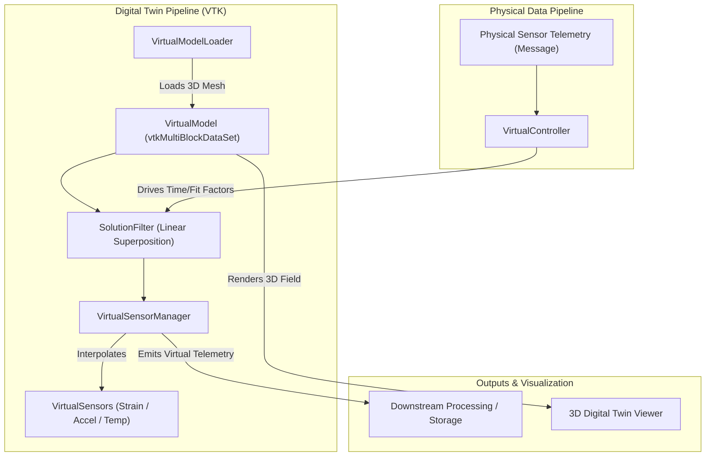
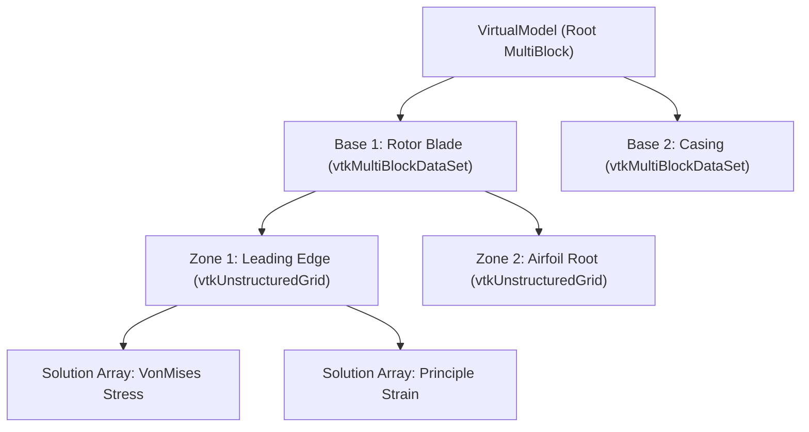
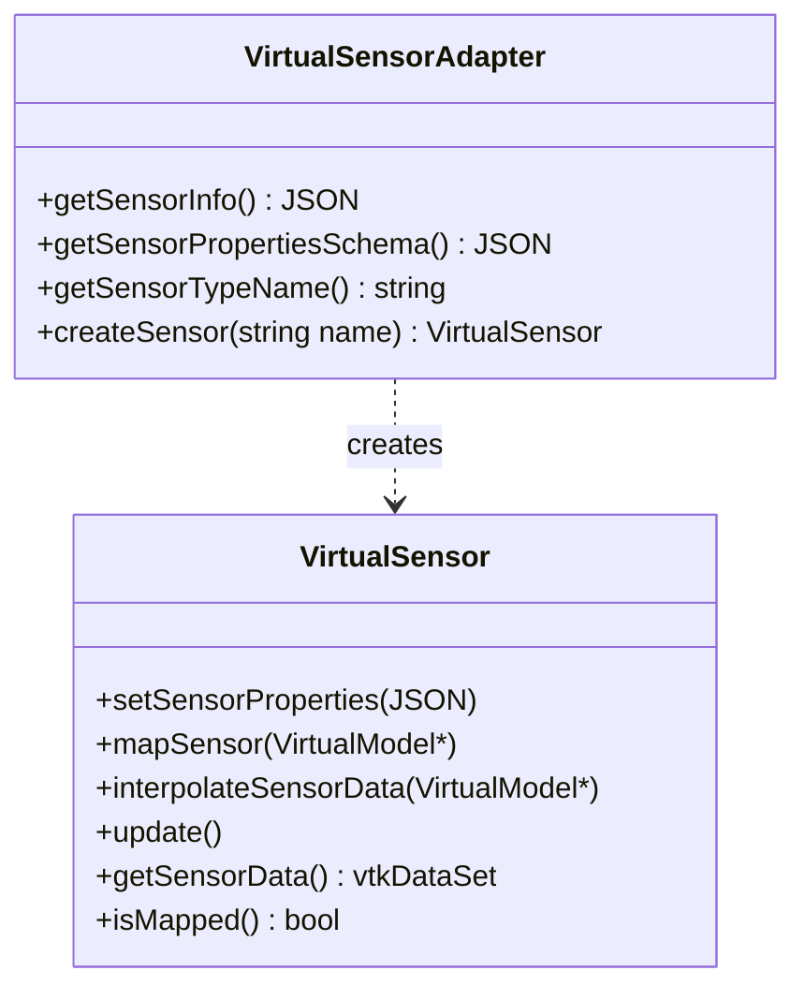
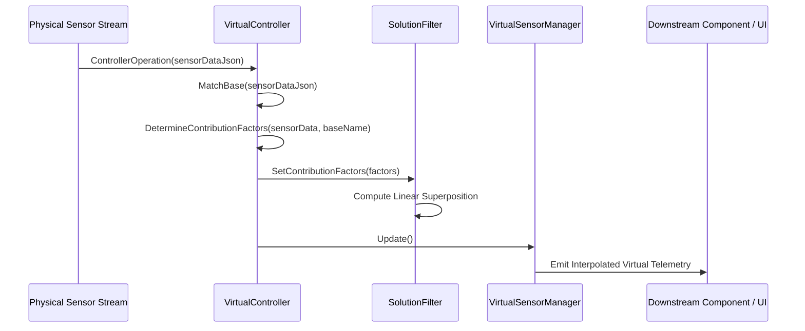

# PhoenixCore Virtual Interface & Digital Twin SDK

## Overview

The `PhoenixCore/Virtual` module provides a high-performance, VTK-based Digital Twin and Virtual Sensing subsystem. It integrates 3D FEA/CAD structural models (ANSYS, NASTRAN, ABAQUS, VTK) with real-time physical sensor telemetry, enabling real-time stress/strain field reconstruction, virtual sensor interpolation, modal response tracking, and structural limit alerting.

The virtual subsystem consists of the following key interfaces and classes:

- **[`VirtualModel`](#virtualmodel-data-structure)**: Specialized `vtkMultiBlockDataSet` container managing hierarchical structural geometry (Bases → Zones → Elements/Nodes) and solution arrays (stress, strain, displacement, temperature).
- **[`VirtualModelLoader`](#virtualmodelloader)**: Base pipeline algorithm (`vtkMultiBlockDataSetAlgorithm`) for importing and configuring 3D structural model files.
- **[`VirtualSensor`](#virtualsensor-base-class)**: Abstract base class for virtual sensors mapped onto 3D geometry (nodal, surface, or volumetric).
- **[`VirtualSensorManager`](#virtualsensormanager)**: VTK pipeline filter managing collections of mapped virtual sensors and computing interpolated telemetry.
- **[`VirtualController`](#virtualcontroller-engine)**: Orchestration controller coordinating model updates, time synchronization, basis matching, and contribution factor scaling.
- **[`SolutionFilter` & Pipeline Filters](#digital-twin-filters)**: VTK algorithms performing linear superposition of mode shapes, normalization, and statistic accumulation.
- **[`VirtualLibrary` & `VirtualAdapter`](#dynamic-plugin-architecture)**: Dynamic plugin architecture enabling runtime discovery and instantiation of virtual model loaders and sensor types via the exported `GetVirtuals` symbol.



---

## VirtualModel Data Structure

`VirtualModel` inherits from `vtkMultiBlockDataSet` and provides domain-specific metadata indexing for multi-zone FEA models:



### Key Methods

- **`GetBase(name)` / `SetCurrentBase(name)`**: Navigates top-level structural components.
- **`GetZone(name)`**: Retrieves individual mesh blocks/zones (`vtkDataObject` or `vtkUnstructuredGrid`).
- **`getCellLocator(blockNumber)`**: Returns a high-speed `vtkStaticCellLocator` for fast point/cell geometric queries.
- **`GetSolutionArrayNames()`**: Lists available solution fields across all mesh zones.
- **`fileMetadata()`**: Returns structured JSON metadata describing model provenance, units, coordinate systems, and limit boundaries.

---

## VirtualSensor & VirtualSensorAdapter

Virtual sensors represent synthetic measurement points positioned on the 3D model geometry.



### Sensor Mapping Constraints

When defining a sensor type in `getSensorInfo()`, the `map_constraint` defines how the sensor projects onto the 3D mesh:
- **`nodal`**: Snaps to the nearest finite element mesh node.
- **`surface`**: Projects perpendicularly onto the nearest 2D surface element face.
- **`volume`**: Locates within 3D tetrahedral/hexahedral solid elements.
- **`none`**: Free-space sensor (e.g. proximity probe referencing a moving surface).

---

## VirtualSensorManager

`VirtualSensorManager` is a VTK pipeline filter (`vtkMultiBlockDataSetAlgorithm`) that acts as the central registry and interpolation engine for all virtual sensors on a model:

```cpp
class VirtualSensorManager : public vtkMultiBlockDataSetAlgorithm
{
public:
    static VirtualSensorManager* New();

    void registerSensorType(std::shared_ptr<VirtualSensorAdapter> adapter);
    void addSensor(const std::string& type, const std::string& name);
    void removeSensor(const std::string& name);
    void clearSensors();

    void setSensorProperties(const std::string& name, const JSON& properties);
    void setSensorProperty(const std::string& name, const std::string& key, const JSON& value);

    void requestRemapSensors();
    void interpolateSensor(const std::string& sensorName, VirtualModel* model);

    const std::vector<std::string> getSensorNames() const;
    const JSON& getSensorProperties(const std::string& name) const;
    bool sensorMapped(const std::string& name) const;
    vtkSmartPointer<vtkDataSet> getSensorData(const std::string& sensorName);
};
```

---

## VirtualController Engine

The `VirtualController` drives the digital twin simulation loop, mapping physical sensor inputs to dynamic modal response weights:



---

## Digital Twin Pipeline Filters

- **`SolutionFilter`**: Performs real-time linear combination of modal solution fields:
  $$\mathbf{S}_{\text{total}}(\mathbf{x}, t) = \sum_{i=1}^{N} c_i(t) \cdot \mathbf{\Phi}_i(\mathbf{x})$$
  where $\mathbf{\Phi}_i$ is the $i$-th FEA mode shape and $c_i(t)$ is the dynamic contribution factor.
- **`NormalizationFilter`**: Normalizes field magnitudes against baseline operating limits.
- **`StatAccumulationFilter`**: Computes peak-hold, RMS, and mean stress fields over sliding time windows.

---

## Step-by-Step Plugin Implementation Guide

### Step 1: Implement a Custom Virtual Sensor

```cpp
#include <PhoenixCore/Virtual/VirtualSensor.hpp>
#include <PhoenixCore/Virtual/VirtualModel.hpp>
#include <vtkPointData.h>
#include <vtkDoubleArray.h>

class VirtualStrainGauge : public VirtualSensor
{
private:
    double m_gaugeFactor = 2.1;
    double m_interpolatedStrain = 0.0;

public:
    VirtualStrainGauge(const std::string& name) 
        : VirtualSensor("virtual_strain_gauge", name) {}

    void mapSensor(VirtualModel* model) override {
        // Project location (X,Y,Z) onto model mesh surface using getCellLocator
        m_mapped = true;
    }

    void interpolateSensorData(VirtualModel* model) override {
        if (!m_mapped || !model) return;
        // Interpolate strain tensor at gauge location and compute directional strain
        m_interpolatedStrain = 1250.0; // Simulated microstrain
    }

    void update() override {
        // Update local parameters when properties change
    }

    vtkSmartPointer<vtkDataSet> getSensorData() override {
        return nullptr;
    }

    const JSON& getSensorPropertiesSchema() override {
        static const JSON schema = {
            {"type", "object"},
            {"properties", {
                {"gauge_length", {{"type", "number"}, {"default", 0.005}}},
                {"gauge_factor", {{"type", "number"}, {"default", 2.1}}}
            }}
        };
        return schema;
    }
};
```

---

### Step 2: Implement Sensor Adapter & Export Symbol

```cpp
#include <PhoenixCore/Virtual/VirtualLibrary.hpp>

class VirtualStrainGaugeAdapter : public VirtualSensorAdapter
{
public:
    std::shared_ptr<VirtualSensor> createSensor(const std::string& name) override {
        return std::make_shared<VirtualStrainGauge>(name);
    }
    const std::string& getSensorTypeName() const override {
        static const std::string s_type = "virtual_strain_gauge";
        return s_type;
    }
    const JSON& getSensorInfo() const override {
        static const JSON s_info = {
            {"type", "virtual_strain_gauge"},
            {"name", "Virtual Uniaxial Strain Gauge"},
            {"map_constraint", "surface"},
            {"description", "Virtual strain gauge measuring directional surface strain"}
        };
        return s_info;
    }
    const JSON& getSensorPropertiesSchema() const override {
        static const JSON s_schema = {{"type", "object"}};
        return s_schema;
    }
};

extern "C" PHOENIXCORE_API_SYMBOL VirtualLibrary* GetVirtuals() {
    static VirtualLibrary* s_lib = nullptr;
    if (!s_lib) {
        std::vector<std::shared_ptr<VirtualAdapter>> adapters;
        // Register model loader and sensor adapters...
        s_lib = new VirtualLibrary("CustomVirtualLibrary", adapters);
    }
    return s_lib;
}
```

---

## Python Usage (`PhoenixPy`)

```python
from phoenixpy import dataTypes, phoenixLic

def run_virtual_sensing_pipeline():
    # 1. License initialization
    lic = phoenixLic.PhoenixLic.instance()
    lic.setAppInfo("PyDigitalTwinApp", "PyDigitalTwinApp", "2026.1", "localhost", "127.0.0.1", 0)
    lic.connect()

    # 2. Configure 3D Point Coordinates
    sensor_loc = dataTypes.Point3dDouble(0.15, 0.42, 0.05)
    print(f"Virtual Sensor Target Location: ({sensor_loc.x()}, {sensor_loc.y()}, {sensor_loc.z()})")

    # 3. Process Solution Fit Data
    fit = dataTypes.SolutionFitData()
    fit.solutionType = dataTypes.SolutionFitData.MODAL
    fit.partIdx = 0
    fit.limitIdx = 1
    fit.fit = 0.965
    fit.criticalLocationValue = 245.8 # MPa
    
    print(f"Modal Fit Result: Mode Type={dataTypes.SolutionFitData.getSolutionTypeString(fit.solutionType)}, Value={fit.criticalLocationValue} MPa")

if __name__ == "__main__":
    run_virtual_sensing_pipeline()
```

---

## Implementation Checklist for Virtual / Digital Twin Developers

- [ ] Subclass `VirtualModelLoader` to import custom CAD/FEA mesh formats into `VirtualModel`.
- [ ] Subclass `VirtualSensor` to implement specialized sensing physics and interpolation.
- [ ] Implement `VirtualSensorAdapter` declaring mapping constraints (`surface`, `nodal`, `volume`).
- [ ] Implement `VirtualAdapter` and export the `GetVirtuals` DLL symbol.
