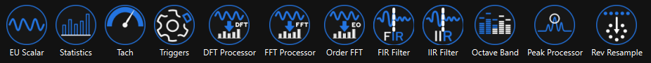

# APEX Phoenix Components

<figure><figcaption></figcaption></figure>

## Description

The PhoenixComponents library offers many default component types for external use.

## Usage

Users can call the standard GetComponents call to receive all of the types, and use them in their Designer registerComponentTypes call. Alternatively, users can use the available listing of type names and create functions to directly create component instances of their choice.

